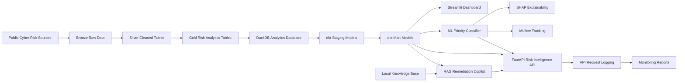

# 🛡️ Cyber Risk Intelligence Lakehouse + AI Remediation Copilot


A full-stack cyber risk intelligence platform that ingests public vulnerability intelligence, builds a Bronze/Silver/Gold lakehouse using PySpark, transforms analytics marts with dbt and DuckDB, visualises risk through Streamlit, trains an explainable ML priority classifier with SHAP and MLflow, exposes the results through FastAPI, provides a local RAG-based remediation copilot for defensive vulnerability response, and records API monitoring metrics for production-readiness.

---

## 📌 Project Summary

This project demonstrates an end-to-end cyber risk data platform for vulnerability prioritisation and remediation planning.

It combines:

- Public cyber risk intelligence ingestion
- PySpark lakehouse ETL
- Bronze, Silver, and Gold data layers
- Data quality validation
- dbt analytics engineering
- DuckDB analytical warehouse
- Streamlit dashboard
- Machine learning priority classifier
- SHAP model explainability
- MLflow experiment tracking
- FastAPI backend service
- Local RAG remediation copilot
- Copilot evaluation report
- API request logging and metrics endpoint
- Monitoring reports for endpoint usage and response time
- GitHub Actions CI

The platform answers questions such as:

- Which vulnerabilities should be prioritised first?
- Which vendors or products have the highest cyber risk?
- Which CWE weakness categories appear most risky?
- How are vulnerability trends changing over time?
- Why did the ML model classify a CVE as High, Medium, or Low priority?
- What defensive remediation actions should be taken for a specific CVE?
- How many API requests were made, which endpoints were used, and how fast did they respond?

---

## 🧱 Architecture



---

## 🌐 Data Sources

The project uses public cyber risk intelligence sources:

- **CISA KEV Catalog** — Known Exploited Vulnerabilities
- **FIRST EPSS** — Exploit Prediction Scoring System
- **NVD CVE API** — Recent CVE vulnerability records, CVSS metrics, CWE weakness data, vendor and product metadata

The data is ingested into a local lakehouse structure and transformed into analytics-ready risk tables.

---

## 📂 Project Structure

```text
cyber-risk-intelligence-lakehouse/
│
├── app/
│   └── dashboard.py
│
├── api/
│   └── main.py
│
├── assets/
│   ├── dashboard_overview.png
│   ├── dashboard_risk_analysis.png
│   └── dashboard_top_vulnerabilities.png
│
├── dbt/
│   └── cyber_risk_dbt/
│       ├── dbt_project.yml
│       ├── profiles.yml
│       └── models/
│           ├── sources.yml
│           ├── staging/
│           └── marts/
│
├── ml/
│   └── train_priority_model.py
│
├── rag/
│   ├── __init__.py
│   ├── remediation_copilot.py
│   └── knowledge_base/
│       ├── cisa_kev_remediation.md
│       ├── cvss_prioritisation.md
│       ├── cwe_remediation.md
│       ├── emergency_response.md
│       └── vulnerability_management.md
│
├── reports/
│   ├── data_quality_report.csv
│   ├── model_metrics.json
│   ├── classification_report.csv
│   ├── confusion_matrix.csv
│   ├── feature_importance.csv
│   ├── feature_importance.png
│   ├── shap_feature_importance.png
│   ├── copilot_eval_report.csv
│   ├── copilot_eval_summary.json
│   ├── api_endpoint_summary.csv
│   └── api_monitoring_summary.json
│
├── scripts/
│   ├── run_ingestion.py
│   ├── build_analytics_database.py
│   ├── validate_lakehouse.py
│   ├── inspect_lakehouse.py
│   ├── run_pipeline.py
│   ├── run_dbt.py
│   ├── run_ml.py
│   ├── run_api.py
│   ├── run_copilot.py
│   ├── evaluate_copilot.py
│   └── generate_monitoring_report.py
│
├── monitoring/
│   └── api_usage_log.csv        # runtime log, ignored by git
│
├── src/
│   └── cyber_risk/
│       ├── ingestion/
│       ├── etl/
│       └── quality/
│
├── requirements.txt
├── pyproject.toml
└── README.md
```

---

## 🥉🥈🥇 Lakehouse Layers

### Bronze Layer

The Bronze layer stores raw downloaded cyber intelligence files from CISA KEV, EPSS, and NVD.

Examples:

```text
data/bronze/kev/
data/bronze/epss/
data/bronze/nvd/
```

### Silver Layer

The Silver layer contains cleaned and normalised PySpark tables.

Silver outputs include:

- Silver KEV table
- Silver EPSS table
- Silver NVD table

### Gold Layer

The Gold layer contains analytics-ready risk tables.

Gold outputs include:

- `vulnerability_priority`
- `vendor_risk_summary`
- `monthly_vulnerability_trends`
- `cwe_risk_summary`

---

## ✅ Latest Validated Lakehouse Output

Latest local pipeline run:

```text
Silver KEV: 1,638 rows
Silver EPSS: 5,000 rows
Silver NVD: 7,479 rows

Gold Vulnerability Priority: 7,479 rows
Gold Vendor Risk Summary: 2,936 rows
Gold Monthly Vulnerability Trends: 2 rows
Gold CWE Risk Summary: 317 rows
```

Data quality validation:

```text
PASS: 18
WARN: 0
FAIL: 0
```

The validation report is exported to:

```text
reports/data_quality_report.csv
```

---

## 🧮 Risk Scoring Logic

The Gold vulnerability priority table combines multiple risk signals:

- CVSS base score
- CVSS severity
- EPSS score and percentile
- CISA KEV known exploited flag
- Attack vector
- Attack complexity
- Privileges required
- User interaction
- CWE weakness category
- Reference count
- Affected vendor and product information

The platform assigns each vulnerability a risk score and priority level:

```text
High
Medium
Low
```

In the latest run, only a small number of vulnerabilities were classified as High priority. This reflects the current live public data snapshot and the strict risk scoring logic.

---

## 🧪 Data Quality Validation

The validation layer checks core data quality rules before downstream analytics are used.

Validation checks include:

- Required columns exist
- CVE IDs are not missing
- CVE IDs are unique
- CVSS scores are between 0 and 10
- EPSS scores are between 0 and 1
- Risk scores are within expected range
- Priority levels are valid
- Known exploited flags are valid binary values
- Vendor and CWE summary tables contain valid counts

Run validation:

```powershell
python .\scripts\validate_lakehouse.py
```

---

## 🧱 dbt + DuckDB Analytics Layer

The project includes a dbt analytics layer on top of the PySpark Gold tables.

DuckDB is used as a local analytical warehouse:

```text
analytics/cyber_risk.duckdb
```

The dbt project builds:

- Source definitions for raw Gold tables
- Staging models for cleaned analytical views
- Mart models for dashboard, API, and ML use cases
- dbt tests for not-null, uniqueness, and accepted values
- dbt docs for model lineage and documentation

Run dbt workflow:

```powershell
python .\scripts\run_dbt.py
```

Run dbt docs locally:

```powershell
dbt docs serve --project-dir dbt\cyber_risk_dbt --profiles-dir dbt\cyber_risk_dbt
```

Then open:

```text
http://localhost:8080
```

---

## 📊 Streamlit Dashboard

The project includes an interactive Streamlit dashboard for exploring cyber risk intelligence.

Run locally:

```powershell
python -m streamlit run app\dashboard.py
```

Dashboard features:

- Cyber risk overview KPIs
- Priority distribution
- Known exploited vulnerability analysis
- Vendor and product risk ranking
- Monthly vulnerability trends
- CWE risk summary
- Top risky vulnerabilities

### Dashboard Screenshots


---

## 🤖 Machine Learning Priority Classifier

The project trains a machine learning classifier to predict vulnerability priority levels using features from the dbt mart table.

Model features include:

- CVSS base score
- CVSS severity label
- Known exploited flag
- Attack vector
- Attack complexity
- Privileges required
- User interaction
- CWE category
- Reference count
- Affected entry count
- Published month

The model is trained using a Random Forest classifier and tracked with MLflow.

Run ML workflow:

```powershell
python .\scripts\run_ml.py
```

Generated outputs:

```text
reports/model_metrics.json
reports/classification_report.csv
reports/confusion_matrix.csv
reports/feature_importance.csv
reports/feature_importance.png
reports/shap_feature_importance.png
models/priority_classifier.joblib
mlruns/
```

The model artifact and MLflow local tracking directory are ignored by Git because they are local runtime artifacts.

---

## 📈 Latest ML Results

Latest model metrics:

```text
Accuracy: 0.9856
Balanced Accuracy: 0.8232
Macro F1: 0.8793
Weighted F1: 0.9855
```

Important note:

The dataset is highly imbalanced. In the latest run, the High-priority class contained only 8 records. Therefore, balanced accuracy and macro F1 are reported alongside overall accuracy to provide a more realistic view of model performance.

---

## 🔎 Model Feature Importance


This chart shows which input features the Random Forest model relied on most when predicting vulnerability priority levels.

The most influential feature is `cvss_base_score`, which means the model heavily depends on the technical severity of a vulnerability. Other important signals include whether the CVE is known to be exploited, CVSS severity labels, CWE weakness categories, and the number of public references.

In practical terms, the model learned that high-risk vulnerabilities are usually associated with stronger severity scores, known exploitation evidence, specific weakness categories, and attack exposure signals.

---

## 🧠 SHAP Explainability


SHAP explains how much each feature contributes to the model's predictions on average.

The SHAP results show that `cvss_base_score`, CVSS severity, known exploitation status, user interaction, attack vector, and reference count are the strongest drivers of the model's vulnerability priority predictions.

This makes the model more interpretable because the prediction is not treated as a black box. Instead, the project can explain why certain vulnerabilities are prioritised higher than others.

### Key Feature Meanings

- `cvss_base_score`: Technical severity score of the vulnerability.
- `is_known_exploited`: Whether the vulnerability appears in the CISA KEV known exploited catalog.
- `cvss_base_severity`: CVSS severity label such as Critical, High, Medium, or Low.
- `cwe_id`: Common Weakness Enumeration category representing the vulnerability weakness type.
- `reference_count`: Number of external references linked to the CVE.
- `attack_vector`: Whether the vulnerability can be exploited over the network, locally, or physically.
- `user_interaction`: Whether exploitation requires user interaction.

---

## 🧪 MLflow Experiment Tracking

The ML workflow uses MLflow to track:

- Model parameters
- Evaluation metrics
- Classification report
- Confusion matrix
- Feature importance artifacts
- SHAP explainability artifacts
- Trained model artifact

Run MLflow UI locally:

```powershell
mlflow ui --backend-store-uri .\mlruns --port 5000
```

Then open:

```text
http://localhost:5000
```

---

## 🚀 FastAPI Risk Intelligence API

The project includes a FastAPI backend service that exposes the lakehouse analytics marts, ML classifier, and RAG remediation copilot through REST API endpoints.

Run the API locally:

```powershell
python .\scripts\run_api.py
```

Open Swagger UI:

```text
http://127.0.0.1:8000/docs
```

### Available API Endpoints

```text
GET  /
GET  /health
GET  /vulnerabilities/top
GET  /vulnerabilities/{cve_id}
GET  /vendors/risk-summary
GET  /cwe/risk-summary
GET  /trends/monthly
POST /predict-priority
GET  /remediation/{cve_id}
GET  /metrics
```

### Example API Checks

Health check:

```powershell
Invoke-RestMethod http://127.0.0.1:8000/health
```

Top risky vulnerabilities:

```powershell
Invoke-RestMethod "http://127.0.0.1:8000/vulnerabilities/top?limit=5"
```

CVE lookup:

```powershell
Invoke-RestMethod "http://127.0.0.1:8000/vulnerabilities/CVE-2016-20068"
```

Vendor risk summary:

```powershell
Invoke-RestMethod "http://127.0.0.1:8000/vendors/risk-summary?limit=5"
```

CWE risk summary:

```powershell
Invoke-RestMethod "http://127.0.0.1:8000/cwe/risk-summary?limit=5"
```

Monthly trends:

```powershell
Invoke-RestMethod "http://127.0.0.1:8000/trends/monthly"
```

API monitoring metrics:

```powershell
Invoke-RestMethod "http://127.0.0.1:8000/metrics" | ConvertTo-Json -Depth 6
```

---

## 🧠 ML Prediction API

The API includes an ML prediction endpoint:

```text
POST /predict-priority
```

Example request:

```powershell
$body = @{
    cvss_base_score = 9.8
    epss_score = 0
    epss_percentile = 0
    is_known_exploited = 1
    reference_count = 5
    affected_entry_count = 1
    published_month = 7
    cvss_base_severity = "CRITICAL"
    attack_vector = "NETWORK"
    attack_complexity = "LOW"
    privileges_required = "NONE"
    user_interaction = "NONE"
    cwe_id = "CWE-434"
} | ConvertTo-Json

Invoke-RestMethod `
    -Uri "http://127.0.0.1:8000/predict-priority" `
    -Method Post `
    -Body $body `
    -ContentType "application/json"
```

Example output:

```json
{
  "predicted_priority_level": "High",
  "prediction_probabilities": {
    "High": 0.5469,
    "Low": 0.0553,
    "Medium": 0.3978
  }
}
```

---

## 🧩 RAG Remediation Copilot

The project includes a local RAG-based remediation copilot that retrieves defensive guidance from a local knowledge base and generates a CVE-specific remediation plan.

The copilot does not require an external LLM API key. It uses TF-IDF retrieval over local remediation documents and combines retrieved knowledge with structured CVE context from the analytics mart.

Knowledge base documents:

```text
rag/knowledge_base/cisa_kev_remediation.md
rag/knowledge_base/cvss_prioritisation.md
rag/knowledge_base/cwe_remediation.md
rag/knowledge_base/emergency_response.md
rag/knowledge_base/vulnerability_management.md
```

The copilot provides:

- CVE context
- Priority explanation
- Urgency classification
- Recommended remediation SLA
- Defensive remediation actions
- Retrieved knowledge sources
- Safety note

Run the copilot locally:

```powershell
python .\scripts\run_copilot.py
```

Example input:

```text
CVE-2026-48908
```

---

## 🛠️ Remediation API Endpoint

The FastAPI service exposes the copilot through:

```text
GET /remediation/{cve_id}
```

Example:

```powershell
Invoke-RestMethod "http://127.0.0.1:8000/remediation/CVE-2026-48908" |
ConvertTo-Json -Depth 8
```

Example output fields:

```json
{
  "cve_id": "CVE-2026-48908",
  "found": true,
  "priority_level": "High",
  "risk_score": 7.7,
  "urgency": "Emergency",
  "recommended_sla": "24 to 72 hours",
  "why_this_priority": [
    "This CVE appears in the known exploited vulnerability signal, so it should be prioritised for urgent remediation.",
    "The CVSS base score is 10.0, with severity CRITICAL.",
    "The attack vector is NETWORK, which increases exposure risk because the vulnerability may be exploitable remotely.",
    "The weakness category is CWE-434, so remediation should consider weakness-specific controls."
  ],
  "recommended_actions": [
    "Confirm whether the affected vendor and product are present in the environment.",
    "Assign a remediation owner and document the remediation deadline.",
    "Prioritise remediation immediately.",
    "Apply vendor patches or mitigations as soon as possible.",
    "If patching is delayed, isolate affected systems or restrict exposure."
  ],
  "retrieved_sources": [
    {
      "file_name": "cisa_kev_remediation.md",
      "similarity_score": 0.4011
    },
    {
      "file_name": "cwe_remediation.md",
      "similarity_score": 0.3465
    }
  ],
  "safety_note": "This copilot provides defensive remediation guidance only. It does not provide exploit instructions or offensive payloads."
}
```

### Context-Aware Remediation

The copilot uses context-aware logic so that emergency recommendations are only used when appropriate.

For example:

- Known exploited or Critical CVEs receive emergency response guidance.
- Medium CVEs receive scheduled remediation guidance.
- CWE-89 vulnerabilities receive SQL injection remediation actions.
- CWE-434 vulnerabilities receive dangerous file upload remediation actions.

This avoids giving emergency remediation instructions to every vulnerability and makes the output more operationally useful.

---

## 🧪 Copilot Evaluation

The project includes a lightweight evaluation script for the remediation copilot.

Run evaluation:

```powershell
python .\scripts\evaluate_copilot.py
```

Latest evaluation result:

```text
Evaluated cases: 5
Passed cases: 5
Failed cases: 0
Pass rate: 1.0
```

Evaluation checks include:

- CVE found in analytics mart
- Remediation actions generated
- Retrieved sources included
- Safety note included
- Priority reasoning included

Generated reports:

```text
reports/copilot_eval_report.csv
reports/copilot_eval_summary.json
```

---


## 📡 API Monitoring and Observability

Phase 6 adds lightweight monitoring for the FastAPI service.

The API records each request into a local runtime CSV log:

```text
monitoring/api_usage_log.csv
```

This log is intentionally ignored by Git because it changes every time the API is used.

The monitoring system captures:

- UTC timestamp
- HTTP method
- API path
- response status code
- response time in milliseconds
- client host

### Metrics Endpoint

The API includes a metrics endpoint:

```text
GET /metrics
```

Example command:

```powershell
Invoke-RestMethod http://127.0.0.1:8000/metrics |
ConvertTo-Json -Depth 6
```

Example output:

```json
{
  "total_requests": 9,
  "error_count": 0,
  "error_rate": 0.0,
  "average_response_time_ms": 16.815,
  "p95_response_time_ms": 28.866,
  "requests_by_path": {
    "/health": 1,
    "/vulnerabilities/top": 1,
    "/vendors/risk-summary": 1,
    "/cwe/risk-summary": 1,
    "/trends/monthly": 1,
    "/remediation/CVE-2026-48908": 1,
    "/metrics": 1
  },
  "requests_by_status_code": {
    "200": 9
  }
}
```

### Monitoring Report Script

Generate API monitoring reports:

```powershell
python .\scripts\generate_monitoring_report.py
```

This creates:

```text
reports/api_endpoint_summary.csv
reports/api_monitoring_summary.json
```

The endpoint summary report includes:

- endpoint path
- request count
- error count
- average response time
- p95 response time

The monitoring summary report includes:

- total requests
- total errors
- error rate
- average response time
- p95 response time
- number of unique paths
- first request timestamp
- last request timestamp

Latest local monitoring summary:

```json
{
  "total_requests": 10,
  "error_count": 0,
  "error_rate": 0.0,
  "average_response_time_ms": 17.106,
  "p95_response_time_ms": 28.373,
  "unique_paths": 9
}
```

### Why This Matters

Monitoring makes the API more production-ready because it helps answer operational questions:

- Which endpoints are being used most often?
- Are any requests failing?
- How fast is the API responding?
- Which endpoint has the highest latency?
- Is the service healthy after adding ML and RAG features?

This is not a full production observability stack, but it demonstrates practical API monitoring, request logging, and operational reporting.

---

## ⚙️ Run the Full Pipeline

Run the full local workflow:

```powershell
python .\scripts\run_pipeline.py
```

This runs:

```text
Bronze ingestion
→ Silver ETL
→ Gold ETL
→ Data quality validation
→ DuckDB analytics database build
→ dbt staging and marts
→ dbt tests and docs
→ Lakehouse inspection
```

Run ML workflow:

```powershell
python .\scripts\run_ml.py
```

Run FastAPI service:

```powershell
python .\scripts\run_api.py
```

Run RAG copilot:

```powershell
python .\scripts\run_copilot.py
```

Run copilot evaluation:

```powershell
python .\scripts\evaluate_copilot.py
```

Generate API monitoring reports:

```powershell
python .\scripts\generate_monitoring_report.py
```

---

## 🧰 Tech Stack

### Data Engineering

- Python
- PySpark
- Parquet
- DuckDB
- dbt

### Data Quality

- Custom validation scripts
- CSV validation reports
- dbt tests

### Dashboard

- Streamlit
- Plotly

### Machine Learning

- scikit-learn
- Random Forest
- SHAP
- MLflow
- joblib

### Backend API

- FastAPI
- Uvicorn
- Pydantic

### RAG Copilot

- Local Markdown knowledge base
- TF-IDF retrieval
- Cosine similarity
- Context-aware remediation generation
- Copilot evaluation report

### Monitoring

- FastAPI middleware
- Request logging
- CSV runtime logs
- Endpoint usage summary
- Response time metrics
- JSON monitoring summary

### DevOps

- Git
- GitHub
- GitHub Actions CI

---

## 🚀 Setup Instructions

Clone the repository:

```powershell
git clone https://github.com/momo840505/cyber-risk-intelligence-lakehouse.git
cd cyber-risk-intelligence-lakehouse
```

Create virtual environment:

```powershell
python -m venv .venv
.\.venv\Scripts\Activate.ps1
```

Install dependencies:

```powershell
python -m pip install --upgrade pip
python -m pip install -r requirements.txt
```

Run the full pipeline:

```powershell
python .\scripts\run_pipeline.py
```

Run the dashboard:

```powershell
python -m streamlit run app\dashboard.py
```

Run ML workflow:

```powershell
python .\scripts\run_ml.py
```

Run API:

```powershell
python .\scripts\run_api.py
```

Open API docs:

```text
http://127.0.0.1:8000/docs
```

Run remediation copilot:

```powershell
python .\scripts\run_copilot.py
```

Generate monitoring report after using the API:

```powershell
python .\scripts\generate_monitoring_report.py
```

---

## ✅ Completed Features

```text
✅ Public cyber risk data ingestion
✅ Bronze / Silver / Gold lakehouse architecture
✅ PySpark ETL pipeline
✅ CISA KEV, EPSS, and NVD data integration
✅ Gold vulnerability risk scoring
✅ Vendor risk summary
✅ CWE risk summary
✅ Monthly vulnerability trend analysis
✅ Data quality validation report
✅ Streamlit dashboard
✅ DuckDB analytics warehouse
✅ dbt staging and mart models
✅ dbt tests and docs
✅ ML priority classifier
✅ SHAP explainability
✅ MLflow experiment tracking
✅ FastAPI backend service
✅ Swagger API documentation
✅ ML prediction API endpoint
✅ Local RAG remediation copilot
✅ Remediation API endpoint
✅ Copilot evaluation report
✅ API request logging middleware
✅ /metrics observability endpoint
✅ Endpoint usage report
✅ API monitoring summary report
✅ Runtime monitoring log ignored by Git
✅ GitHub Actions CI
```

---

## ⚠️ Limitations

- The project currently runs locally rather than on a deployed cloud environment.
- Public cyber risk data changes over time, so row counts and risk rankings may change between pipeline runs.
- EPSS values may be null when the latest NVD CVEs do not appear in the top EPSS dataset.
- The ML classifier is trained on a highly imbalanced target distribution.
- The remediation copilot is retrieval-based and does not replace expert security review.
- The copilot provides defensive remediation guidance only and does not provide exploit instructions.
- The current RAG implementation uses a local knowledge base instead of a production vector database.
- The monitoring implementation is lightweight local logging, not a full Prometheus/Grafana production stack.

---

## 🔮 Future Improvements

Planned next phases:

```text
Phase 6: Monitoring and API logging ✅
Phase 7: Docker deployment
Phase 8: AWS deployment
Phase 9: Terraform infrastructure
Phase 10: Production CI/CD
```

Possible future enhancements:

- Add Docker Compose for dashboard, API, and ML services
- Add structured JSON logging
- Add Prometheus-style monitoring metrics
- Add Grafana dashboard templates
- Add API request validation tests
- Add a vector database for RAG retrieval
- Add optional LLM-based remediation narrative generation
- Add AWS S3 lakehouse storage
- Add Athena or Glue integration
- Add Terraform infrastructure templates
- Deploy FastAPI to AWS App Runner, ECS, or Lambda
- Deploy Streamlit dashboard to a public hosting platform

---

## 👤 Author

**Mo Mo**

Master of Data Science student building practical data engineering, analytics engineering, machine learning, and AI portfolio projects.

Project focus:

```text
Cybersecurity data engineering
Lakehouse architecture
Analytics engineering
Machine learning explainability
Risk intelligence APIs
RAG-based remediation assistance
```

---

## 📌 Current Status

```text
Status: Phase 6 Complete
Latest completed phase: API Monitoring and Metrics Reporting
CI status: Passing
Local pipeline: Passing
Dashboard: Working
API: Working locally
ML workflow: Working locally
RAG copilot: Working locally
Copilot evaluation: Passing
API monitoring: Working locally
Metrics endpoint: Working locally
Monitoring report: Generated
```
