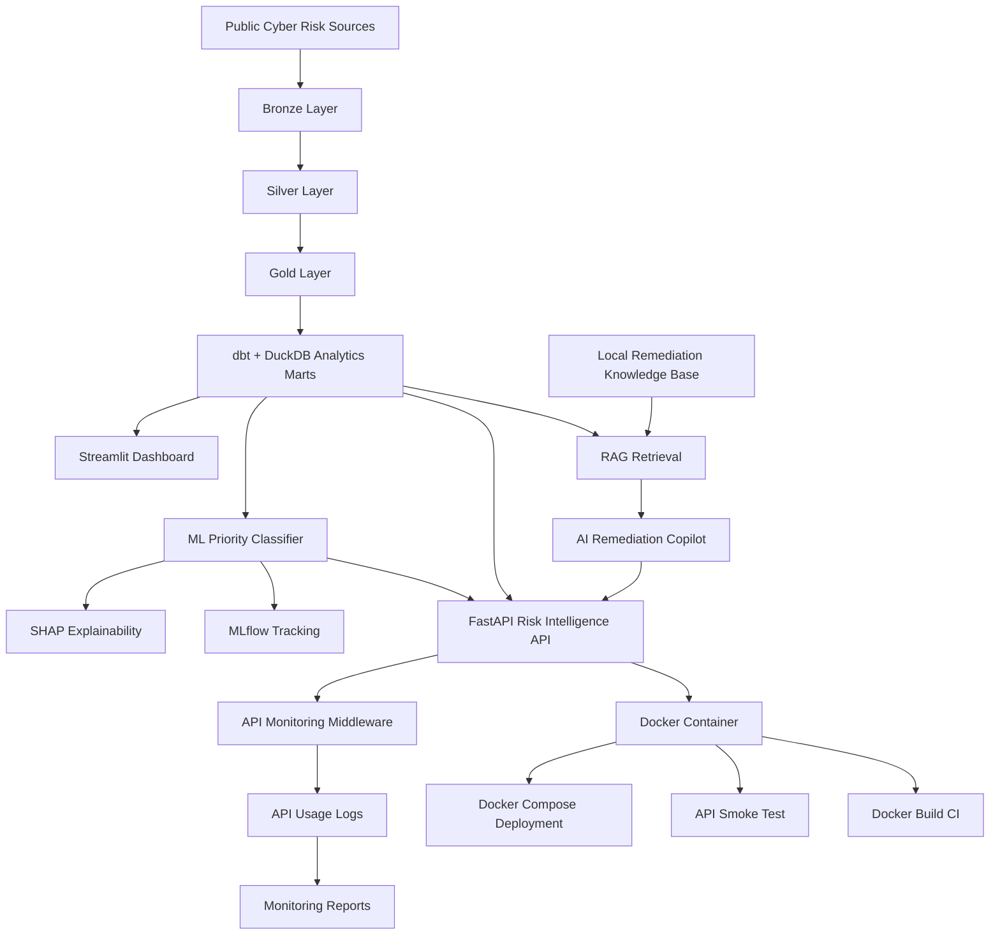

# Cyber Risk Intelligence Lakehouse + AI Remediation Copilot

[](https://github.com/momo840505/cyber-risk-intelligence-lakehouse/actions)
[](https://github.com/momo840505/cyber-risk-intelligence-lakehouse/actions)


## Overview

This project is an end-to-end **Cyber Risk Intelligence Platform** that combines data engineering, analytics engineering, machine learning, API development, RAG-based remediation guidance, monitoring, and Docker deployment readiness.

It ingests public cyber risk data, builds a PySpark lakehouse, transforms analytics marts with dbt and DuckDB, trains a vulnerability priority classifier, explains model behaviour with SHAP, exposes risk intelligence through FastAPI, generates defensive remediation plans using local RAG retrieval, tracks API usage through monitoring logs, and provides Docker deployment support.

The project is designed as a portfolio-ready platform for roles such as:

- Data Engineer
- Analytics Engineer
- Data Scientist
- Machine Learning Engineer
- AI Engineer
- Security Data Analyst

---

## Current Status

```text
✅ Phase 1: PySpark Cyber Risk Lakehouse
✅ Phase 2: dbt + DuckDB Analytics Layer
✅ Phase 3: ML Priority Classifier + SHAP + MLflow
✅ Phase 4: FastAPI Risk Intelligence API
✅ Phase 5: RAG Remediation Copilot
✅ Phase 6: API Monitoring and Observability
✅ Phase 7: Docker Deployment Readiness
```

---

## Architecture



---

## Data Sources

The platform uses public cyber risk intelligence sources:

- **CISA Known Exploited Vulnerabilities (KEV)**: identifies vulnerabilities with evidence of active exploitation.
- **EPSS vulnerability scoring data**: enriches vulnerabilities with exploit probability signals when available.
- **NVD CVE data**: provides CVE metadata, CVSS severity, CWE information, vendor/product information, and vulnerability descriptions.

---

## Project Structure

```text
cyber-risk-intelligence-lakehouse/
├── api/
│   └── main.py
├── app/
│   └── dashboard.py
├── assets/
│   ├── dashboard_overview.png
│   ├── dashboard_risk_analysis.png
│   └── dashboard_top_vulnerabilities.png
├── data/
│   ├── bronze/
│   ├── silver/
│   └── gold/
├── dbt/
│   └── cyber_risk_dbt/
├── ml/
│   └── train_priority_model.py
├── models/
│   └── priority_classifier.joblib
├── monitoring/
│   └── api_usage_log.csv
├── rag/
│   ├── remediation_copilot.py
│   └── knowledge_base/
├── reports/
│   ├── data_quality_report.csv
│   ├── model_metrics.json
│   ├── feature_importance.png
│   ├── shap_feature_importance.png
│   ├── copilot_eval_report.csv
│   ├── copilot_eval_summary.json
│   ├── api_endpoint_summary.csv
│   └── api_monitoring_summary.json
├── scripts/
│   ├── run_pipeline.py
│   ├── run_dbt.py
│   ├── run_ml.py
│   ├── run_api.py
│   ├── evaluate_copilot.py
│   ├── generate_monitoring_report.py
│   └── smoke_test_api.py
├── src/
│   └── cyber_risk/
├── .github/
│   └── workflows/
│       ├── ci.yml
│       └── docker-build.yml
├── Dockerfile
├── docker-compose.yml
├── requirements.txt
├── requirements-api.txt
├── .dockerignore
├── .gitignore
└── README.md
```

---

## Lakehouse Layers

### Bronze Layer

The Bronze layer stores raw ingested cyber risk data from public sources, including CISA KEV, EPSS, and NVD CVE records.

### Silver Layer

The Silver layer cleans and normalises records for analytics:

- Standardised CVE IDs
- Normalised CVSS fields
- Parsed CWE IDs
- Vendor and product extraction
- Known exploited vulnerability flags
- Reference and affected product counts

### Gold Layer

The Gold layer produces analytics-ready datasets:

- `vulnerability_priority`
- `vendor_risk_summary`
- `monthly_vulnerability_trends`
- `cwe_risk_summary`

---

## Risk Scoring Logic

The project uses an explainable risk scoring approach that combines:

- CVSS base score
- Known exploited vulnerability status
- EPSS score when available
- Attack vector
- Weakness type
- Reference count
- Affected product count

The goal is to produce both a risk score and an explainable prioritisation output for security stakeholders.

---

## Data Quality Validation

The project includes automated validation for Gold lakehouse outputs.

Validation checks include:

- Required columns exist
- CVE IDs are not missing
- CVE IDs are unique where expected
- CVSS scores are within valid range
- EPSS scores are within valid range when available
- Risk scores are within expected bounds
- Priority levels are valid
- Known exploited flags are binary
- Vendor risk summary tables contain required fields

Run validation:

```powershell
python .\scripts\validate_lakehouse.py
```

Example result:

```text
PASS: 18
WARN: 0
FAIL: 0
Data quality validation completed successfully.
```

---

## dbt Analytics Layer

The dbt layer builds staging and mart models on top of a DuckDB analytics database.

Staging models:

- `stg_vulnerability_priority`
- `stg_vendor_risk_summary`
- `stg_monthly_vulnerability_trends`
- `stg_cwe_risk_summary`

Mart models:

- `mart_vulnerability_priority`
- `mart_vendor_risk_summary`
- `mart_monthly_vulnerability_trends`
- `mart_cwe_risk_summary`

Run dbt:

```powershell
python .\scripts\run_dbt.py
```

Example dbt result:

```text
Done. PASS=26 WARN=0 ERROR=0 SKIP=0 NO-OP=0 TOTAL=26
```

Serve dbt docs:

```powershell
cd dbt\cyber_risk_dbt
dbt docs generate
dbt docs serve
```

---

## Machine Learning Priority Classifier

The ML component trains a classifier that predicts vulnerability priority level:

```text
Low
Medium
High
```

Example features:

- `cvss_base_score`
- `epss_score`
- `epss_percentile`
- `is_known_exploited`
- `reference_count`
- `affected_entry_count`
- `published_month`
- `cvss_base_severity`
- `attack_vector`
- `attack_complexity`
- `privileges_required`
- `user_interaction`
- `cwe_id`

Current model metrics:

```json
{
  "training_rows": 5609,
  "test_rows": 1870,
  "accuracy": 0.9856,
  "balanced_accuracy": 0.8232,
  "macro_f1": 0.8793,
  "weighted_f1": 0.9855,
  "classes": ["High", "Low", "Medium"]
}
```

Important note: the `High` class is highly imbalanced, so balanced accuracy and macro F1 are more meaningful than accuracy alone.

Run ML workflow:

```powershell
python .\scripts\run_ml.py
```

---

## MLflow Tracking

The ML workflow logs experiment metadata with MLflow.

Tracked outputs include:

- Model metrics
- Classifier configuration
- Model artifact
- Feature importance
- SHAP explainability outputs

---

## Model Explainability with SHAP

The project includes two explainability outputs:

```text
reports/feature_importance.png
reports/shap_feature_importance.png
```

### Feature Importance


The feature importance plot shows which input variables the classifier uses most often to split and classify vulnerabilities.

### SHAP Feature Importance


The SHAP plot explains which features have the strongest average impact on model predictions.

Important features include:

- CVSS base score
- Known exploited status
- CVSS severity
- CWE category
- Reference count
- User interaction
- Attack vector

---

## FastAPI Risk Intelligence API

### Local API URL

```text
http://127.0.0.1:8001
```

### Swagger UI

```text
http://127.0.0.1:8001/docs
```

### Metrics Endpoint

```text
http://127.0.0.1:8001/metrics
```

Start the API locally:

```powershell
python .\scripts\run_api.py
```

The script starts FastAPI on port `8001` by default.

---

## API Endpoints

| Method | Endpoint | Description |
|---|---|---|
| GET | `/` | Service metadata |
| GET | `/health` | Health check for analytics DB, model, and monitoring log |
| GET | `/metrics` | API usage and response time metrics |
| GET | `/vulnerabilities/top` | Top vulnerabilities ranked by risk |
| GET | `/vulnerabilities/{cve_id}` | CVE-level detail lookup |
| GET | `/vendors/risk-summary` | Vendor and product risk summary |
| GET | `/cwe/risk-summary` | CWE-level risk summary |
| GET | `/trends/monthly` | Monthly vulnerability trend summary |
| POST | `/predict-priority` | ML priority prediction |
| GET | `/remediation/{cve_id}` | RAG-based remediation plan |

---

## Example API Usage

### Health Check

```powershell
Invoke-RestMethod http://127.0.0.1:8001/health | ConvertTo-Json -Depth 5
```

Example response:

```json
{
  "status": "ok",
  "analytics_database_exists": true,
  "model_exists": true,
  "monitoring_log_exists": true
}
```

### Top Vulnerabilities

```powershell
Invoke-RestMethod "http://127.0.0.1:8001/vulnerabilities/top?limit=5"
```

### CVE Lookup

```powershell
Invoke-RestMethod "http://127.0.0.1:8001/vulnerabilities/CVE-2016-20068"
```

### ML Prediction

```powershell
$body = @{
    cvss_base_score = 9.8
    epss_score = 0
    epss_percentile = 0
    is_known_exploited = 1
    reference_count = 5
    affected_entry_count = 1
    published_month = 7
    cvss_base_severity = "CRITICAL"
    attack_vector = "NETWORK"
    attack_complexity = "LOW"
    privileges_required = "NONE"
    user_interaction = "NONE"
    cwe_id = "CWE-434"
} | ConvertTo-Json

Invoke-RestMethod `
    -Uri "http://127.0.0.1:8001/predict-priority" `
    -Method Post `
    -ContentType "application/json" `
    -Body $body |
ConvertTo-Json -Depth 5
```

---

## RAG Remediation Copilot

The project includes a local retrieval-based remediation copilot. It does not require an external LLM API key.

The copilot retrieves defensive guidance from a local remediation knowledge base and generates context-aware remediation plans using:

- CVE metadata
- CVSS severity
- Known exploited status
- Attack vector
- CWE weakness type
- Priority level
- Local security remediation playbooks

Knowledge base:

```text
rag/knowledge_base/
├── cisa_kev_remediation.md
├── cvss_prioritisation.md
├── cwe_remediation.md
├── emergency_response.md
└── vulnerability_management.md
```

Example remediation API:

```powershell
Invoke-RestMethod "http://127.0.0.1:8001/remediation/CVE-2026-48908" |
ConvertTo-Json -Depth 8
```

Example output includes:

```text
priority_level
risk_score
urgency
recommended_sla
vulnerability_context
why_this_priority
recommended_actions
retrieved_sources
safety_note
```

### Security-Safe Behaviour

The copilot is designed for defensive remediation guidance only.

It does not provide:

- Exploit instructions
- Offensive payloads
- Attack execution steps
- Weaponisation guidance

---

## Copilot Evaluation

Run evaluation:

```powershell
python .\scripts\evaluate_copilot.py
```

Example result:

```json
{
  "evaluated_cases": 5,
  "passed_cases": 5,
  "failed_cases": 0,
  "pass_rate": 1.0
}
```

Reports:

```text
reports/copilot_eval_report.csv
reports/copilot_eval_summary.json
```

---

## API Monitoring and Observability

Phase 6 adds lightweight API monitoring.

The FastAPI middleware records:

- Timestamp
- HTTP method
- Request path
- Status code
- Response time
- Client host

Runtime log:

```text
monitoring/api_usage_log.csv
```

This runtime log is excluded from Git.

### Metrics Endpoint

```powershell
Invoke-RestMethod http://127.0.0.1:8001/metrics |
ConvertTo-Json -Depth 6
```

Example metrics:

```json
{
  "total_requests": 10,
  "error_count": 0,
  "error_rate": 0.0,
  "average_response_time_ms": 17.106,
  "p95_response_time_ms": 28.373,
  "unique_paths": 9
}
```

### Generate Monitoring Report

```powershell
python .\scripts\generate_monitoring_report.py
```

Generated reports:

```text
reports/api_endpoint_summary.csv
reports/api_monitoring_summary.json
```

---

## Docker Deployment Readiness

Phase 7 adds Docker support for the FastAPI risk intelligence service.

Docker files:

```text
Dockerfile
docker-compose.yml
.dockerignore
requirements-api.txt
scripts/smoke_test_api.py
.github/workflows/docker-build.yml
```

### Port Mapping

The container runs FastAPI internally on port `8000`.

The local machine accesses the container through port `8001`.

```text
Local machine: http://127.0.0.1:8001
Docker container: http://0.0.0.0:8000
Port mapping: 8001:8000
```

### Build Docker Image

```powershell
docker compose build
```

### Start Docker API

```powershell
docker compose up -d
```

### Check Container Status

```powershell
docker compose ps
```

Expected status:

```text
Up ... (healthy)
0.0.0.0:8001->8000/tcp
```

### Test Docker API

```powershell
Invoke-RestMethod http://127.0.0.1:8001/health | ConvertTo-Json -Depth 5
```

Expected response:

```json
{
  "status": "ok",
  "analytics_database_exists": true,
  "model_exists": true,
  "monitoring_log_exists": true
}
```

### Run API Smoke Test

```powershell
python .\scripts\smoke_test_api.py
```

Expected result:

```text
========== API Smoke Test ==========
Base URL: http://127.0.0.1:8001
PASS /health
PASS /vulnerabilities/top
PASS /remediation/CVE-2026-48908
PASS /metrics

All smoke tests passed.
```

### View Docker Logs

```powershell
docker compose logs --tail=50
```

### Stop Docker API

```powershell
docker compose down
```

---

## Docker Build CI

The repository includes a Docker Build workflow:

```text
.github/workflows/docker-build.yml
```

The workflow builds the Docker image on:

- Push to `main`
- Pull requests

This validates that the API container can be built successfully in CI.

---

## Streamlit Dashboard

Run dashboard:

```powershell
python -m streamlit run app\dashboard.py
```

Dashboard screenshots:


---

## One-Command Pipeline

Run the full local pipeline:

```powershell
python .\scripts\run_pipeline.py
```

The pipeline executes:

```text
Bronze ingestion
→ Build Silver tables
→ Build Gold tables
→ Validate Gold tables
→ Build dbt analytics marts
→ Inspect lakehouse outputs
```

---

## Local Setup

### 1. Clone Repository

```powershell
git clone https://github.com/momo840505/cyber-risk-intelligence-lakehouse.git
cd cyber-risk-intelligence-lakehouse
```

### 2. Create Virtual Environment

```powershell
python -m venv .venv
.\.venv\Scripts\Activate.ps1
```

### 3. Install Dependencies

```powershell
python -m pip install --upgrade pip
python -m pip install -r requirements.txt
```

### 4. Configure Hadoop on Windows

PySpark on Windows may require `winutils.exe`.

Example configuration:

```powershell
$env:HADOOP_HOME = "C:\hadoop"
$env:Path = "C:\hadoop\bin;$env:Path"
```

Check:

```powershell
Test-Path C:\hadoop\bin\winutils.exe
```

### 5. Run Pipeline

```powershell
python .\scripts\run_pipeline.py
```

### 6. Run ML Workflow

```powershell
python .\scripts\run_ml.py
```

### 7. Start API

```powershell
python .\scripts\run_api.py
```

### 8. Start Docker API

```powershell
docker compose up -d
```

---

## Useful Commands

### Run Data Quality Validation

```powershell
python .\scripts\validate_lakehouse.py
```

### Build dbt Analytics Layer

```powershell
python .\scripts\run_dbt.py
```

### Train ML Model

```powershell
python .\scripts\run_ml.py
```

### Start FastAPI

```powershell
python .\scripts\run_api.py
```

### Run Copilot Evaluation

```powershell
python .\scripts\evaluate_copilot.py
```

### Generate Monitoring Report

```powershell
python .\scripts\generate_monitoring_report.py
```

### Build Docker API

```powershell
docker compose build
```

### Run Docker API

```powershell
docker compose up -d
```

### Run API Smoke Test

```powershell
python .\scripts\smoke_test_api.py
```

---

## CI/CD

The repository includes GitHub Actions workflows for:

- Python CI
- Docker Build CI

The Python CI validates the core project workflow.

The Docker Build workflow validates that the FastAPI service can be containerised successfully.

---

## Portfolio Value

This project demonstrates:

### Data Engineering

- PySpark ETL
- Bronze/Silver/Gold lakehouse design
- Data validation
- Pipeline automation

### Analytics Engineering

- dbt staging and marts
- DuckDB analytics database
- SQL transformation layer
- dbt tests and docs

### Machine Learning

- Feature engineering
- Priority classification
- Model evaluation
- Class imbalance awareness
- MLflow tracking

### Explainable AI

- Feature importance
- SHAP explainability
- Model interpretation

### AI Engineering

- Retrieval-based remediation copilot
- Local knowledge base
- Context-aware recommendation logic
- Safety-aware defensive responses

### Backend Engineering

- FastAPI service
- Swagger documentation
- REST API endpoints
- ML inference endpoint

### MLOps / Platform Engineering

- API monitoring
- Runtime logging
- Metrics endpoint
- Docker containerisation
- Docker Compose deployment
- Docker Build CI

### Cybersecurity Analytics

- CVE prioritisation
- CISA KEV enrichment
- CVSS analysis
- CWE remediation guidance
- Defensive vulnerability management

---

## Limitations

Current limitations:

- The API uses local DuckDB and local model artifacts.
- Docker Compose mounts local `analytics/` and `models/` directories.
- The RAG copilot uses a local knowledge base rather than a production vector database.
- EPSS values may be missing depending on available source data.
- The ML model is affected by class imbalance, especially for the `High` class.
- Current deployment is local Docker deployment, not yet cloud-hosted.

---

## Future Improvements

Planned next steps:

- Terraform infrastructure template
- AWS deployment architecture
- Cloud-ready storage and compute design
- API authentication
- Container registry publishing
- Cloud monitoring and alerting
- Production vector database for RAG
- More advanced LLM evaluation
- Scheduled data refresh workflow

---

## Author

**Wei-Ting Mo (MOMO)**

GitHub: [momo840505](https://github.com/momo840505)
