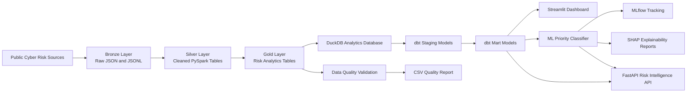
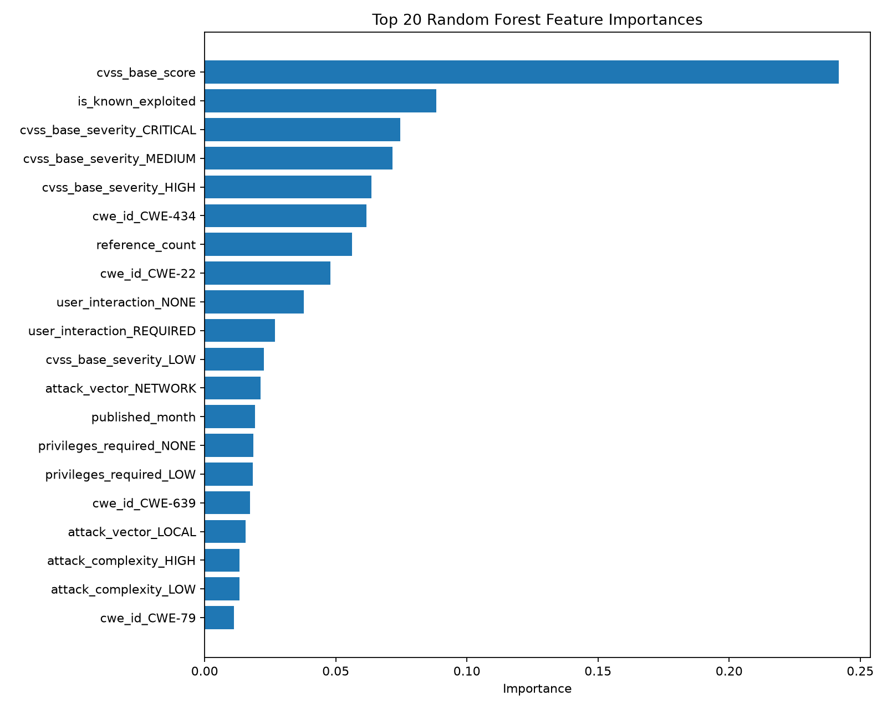
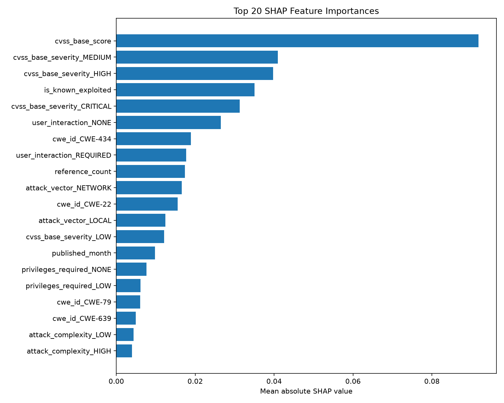

# Cyber Risk Intelligence Lakehouse + ML Risk API


A cyber risk intelligence platform that ingests public vulnerability data, builds a local lakehouse with PySpark, validates Gold-layer data quality, creates dbt analytics marts in DuckDB, trains an ML priority classifier with SHAP explainability and MLflow tracking, and exposes the results through a FastAPI risk intelligence service.

---

## Project Overview

This project simulates an end-to-end cyber risk analytics platform for vulnerability prioritisation.

It combines data engineering, analytics engineering, machine learning, explainable AI, dashboarding, and backend API development into one portfolio-ready project.

The system ingests public cyber risk data from:

- CISA Known Exploited Vulnerabilities catalog
- FIRST EPSS exploit prediction scores
- NVD recent CVE vulnerability data

The pipeline transforms raw vulnerability records into curated Silver and Gold analytics tables, validates the outputs, builds dbt marts, trains a machine learning classifier, generates SHAP explainability reports, and serves the final intelligence layer through both Streamlit and FastAPI.

---

## Architecture



---

## Key Features

### Data Engineering

- Public cyber risk data ingestion
- Bronze / Silver / Gold lakehouse architecture
- PySpark ETL pipelines
- Structured Parquet output tables
- Data quality validation
- One-command full pipeline runner

### Analytics Engineering

- DuckDB local analytics database
- dbt source definitions
- dbt staging models
- dbt mart models
- dbt tests
- dbt docs

### Machine Learning

- Vulnerability priority classification
- Random Forest classifier
- Scikit-learn pipeline
- Model metrics reports
- Feature importance analysis
- MLflow experiment tracking
- SHAP explainability reports

### Backend API

- FastAPI REST service
- Swagger UI documentation
- CVE lookup endpoint
- Top vulnerability ranking endpoint
- Vendor risk summary endpoint
- CWE risk summary endpoint
- Monthly trend endpoint
- ML prediction endpoint

### Dashboard

- Streamlit dashboard
- Executive KPI overview
- Risk distribution analysis
- Vendor and CWE risk summaries
- Top vulnerabilities table
- Interactive Plotly charts

---

## Tech Stack

| Area | Tools |
|---|---|
| Language | Python |
| Data Engineering | PySpark, Pandas, PyArrow |
| Storage | Local Data Lake, Parquet |
| Analytics Database | DuckDB |
| Analytics Engineering | dbt-duckdb |
| Dashboard | Streamlit, Plotly |
| Machine Learning | Scikit-learn, Random Forest |
| Explainability | SHAP |
| Experiment Tracking | MLflow |
| Backend API | FastAPI, Uvicorn |
| Data Quality | Custom validation scripts |
| CI/CD | GitHub Actions |
| Version Control | Git, GitHub |

---

## Data Sources

| Source | Purpose |
|---|---|
| CISA KEV | Identifies vulnerabilities known to be actively exploited |
| FIRST EPSS | Provides exploit probability signals |
| NVD CVE Data | Provides recent CVE metadata, CVSS scores, CWE IDs, vendors, products, and references |

---

## Project Structure

```text
cyber-risk-intelligence-lakehouse/
├── .github/
│   └── workflows/
│       └── python-ci.yml
│
├── api/
│   └── main.py
│
├── app/
│   └── dashboard.py
│
├── assets/
│   ├── dashboard_overview.png
│   ├── dashboard_risk_analysis.png
│   └── dashboard_top_vulnerabilities.png
│
├── dbt/
│   └── cyber_risk_dbt/
│       ├── dbt_project.yml
│       ├── profiles.yml
│       └── models/
│           ├── sources.yml
│           ├── staging/
│           └── marts/
│
├── ml/
│   └── train_priority_model.py
│
├── models/
│   └── priority_classifier.joblib
│
├── reports/
│   ├── classification_report.csv
│   ├── confusion_matrix.csv
│   ├── data_quality_report.csv
│   ├── feature_importance.csv
│   ├── feature_importance.png
│   ├── model_metrics.json
│   └── shap_feature_importance.png
│
├── scripts/
│   ├── build_analytics_database.py
│   ├── inspect_lakehouse.py
│   ├── run_api.py
│   ├── run_dbt.py
│   ├── run_ingestion.py
│   ├── run_ml.py
│   ├── run_pipeline.py
│   └── validate_lakehouse.py
│
├── src/
│   └── cyber_risk/
│       ├── etl/
│       ├── ingestion/
│       └── quality/
│
├── requirements.txt
├── pyproject.toml
└── README.md
```

Note: local data, DuckDB files, MLflow tracking files, and trained model artifacts are ignored by Git where appropriate.

---

## Lakehouse Layers

### Bronze Layer

The Bronze layer stores raw source files in JSON and JSONL format.

Examples:

```text
data/bronze/kev/
data/bronze/epss/
data/bronze/nvd/
```

### Silver Layer

The Silver layer standardises and cleans the raw data into structured PySpark tables.

Silver outputs include:

- `silver_kev`
- `silver_epss`
- `silver_nvd`

### Gold Layer

The Gold layer creates analytics-ready tables for reporting, prioritisation, dashboarding, dbt marts, ML training, and API serving.

Gold outputs include:

- `vulnerability_priority`
- `vendor_risk_summary`
- `monthly_vulnerability_trends`
- `cwe_risk_summary`

---

## Latest Validated Pipeline Output

Latest full pipeline run produced:

| Table | Rows |
|---|---:|
| Silver KEV | 1,638 |
| Silver EPSS | 5,000 |
| Silver NVD | 7,479 |
| Gold Vulnerability Priority | 7,479 |
| Gold Vendor Risk Summary | 2,936 |
| Gold Monthly Vulnerability Trends | 2 |
| Gold CWE Risk Summary | 317 |

Latest data quality validation:

```text
PASS: 18
WARN: 0
FAIL: 0
```

The validation report is exported to:

```text
reports/data_quality_report.csv
```

---

## Risk Scoring Logic

The project combines multiple vulnerability risk signals:

- CVSS base score
- CVSS severity
- EPSS score and percentile
- CISA KEV known exploitation flag
- Attack vector
- Attack complexity
- Privileges required
- User interaction
- Reference count
- Affected product entries

The final Gold table assigns a risk score and priority label:

```text
Critical
High
Medium
Low
```

The current latest run contains:

| Priority Level | Count |
|---|---:|
| High | 8 |
| Medium | 4,188 |
| Low | 3,283 |

There are currently no Critical records in the latest run.

---

## Data Quality Validation

The validation workflow checks:

- Required table existence
- Required column existence
- Missing CVE IDs
- Duplicate CVE IDs
- CVSS score range
- EPSS score range
- Risk score range
- Valid priority values
- Valid known exploited flag values
- Positive vendor vulnerability counts
- Valid month values
- Missing CWE IDs

Run validation:

```powershell
python .\scripts\validate_lakehouse.py
```

Expected output:

```text
========== Summary ==========
PASS: 18
WARN: 0
FAIL: 0

Data quality validation completed successfully.
```

---

## dbt Analytics Layer

The project includes a dbt analytics engineering layer built on DuckDB.

The dbt layer contains:

- Source definitions for Gold tables
- Staging models
- Mart models
- Data tests
- dbt documentation

Run dbt workflow:

```powershell
python .\scripts\run_dbt.py
```

This command:

1. Builds the DuckDB analytics database
2. Runs dbt build
3. Generates dbt docs

Expected dbt result:

```text
Done. PASS=26 WARN=0 ERROR=0 SKIP=0 NO-OP=0 TOTAL=26
```

Serve dbt docs locally:

```powershell
dbt docs serve --project-dir dbt\cyber_risk_dbt --profiles-dir dbt\cyber_risk_dbt
```

---

## Machine Learning Priority Classifier

The project trains a Random Forest model to classify vulnerability priority levels.

The model uses features such as:

- CVSS base score
- CVSS severity
- Known exploited flag
- Reference count
- Affected entry count
- Attack vector
- Attack complexity
- Privileges required
- User interaction
- CWE ID
- Published month

Run ML workflow:

```powershell
python .\scripts\run_ml.py
```

This command:

1. Rebuilds dbt analytics marts
2. Trains the ML classifier
3. Saves model metrics
4. Saves classification reports
5. Generates feature importance chart
6. Generates SHAP explainability chart
7. Logs experiment outputs to MLflow

---

## Model Metrics

Latest model metrics:

| Metric | Value |
|---|---:|
| Accuracy | 0.9856 |
| Balanced Accuracy | 0.8232 |
| Macro F1 | 0.8793 |
| Weighted F1 | 0.9855 |
| Training Rows | 5,609 |
| Test Rows | 1,870 |

Important note:

The dataset is highly imbalanced. The latest run contains only 8 High-priority vulnerabilities, while Medium and Low contain thousands of records. For that reason, balanced accuracy and macro F1 are reported alongside overall accuracy.

Overall accuracy is useful, but it should not be interpreted alone.

---

## Model Feature Importance



This chart shows which input features the Random Forest model relied on most when predicting vulnerability priority levels.

The most influential feature is `cvss_base_score`, which means the model heavily depends on the technical severity of a vulnerability. Other important signals include whether the CVE is known to be exploited, CVSS severity labels, CWE weakness categories, and the number of public references.

In practical terms, the model learned that high-risk vulnerabilities are usually associated with stronger severity scores, known exploitation evidence, and specific weakness categories.

---

## SHAP Explainability



SHAP explains how much each feature contributes to the model's predictions on average.

The SHAP results show that `cvss_base_score`, CVSS severity, known exploitation status, user interaction, attack vector, and reference count are the strongest drivers of the model's vulnerability priority predictions.

This makes the model more interpretable because the prediction is not treated as a black box. Instead, the project can explain why certain vulnerabilities are prioritised higher than others.

---

## Key Feature Meanings

| Feature | Meaning |
|---|---|
| `cvss_base_score` | Technical severity score of the vulnerability |
| `is_known_exploited` | Whether the vulnerability appears in the CISA KEV known exploited catalog |
| `cvss_base_severity` | CVSS severity label such as Critical, High, Medium, or Low |
| `cwe_id` | Common Weakness Enumeration category representing the vulnerability weakness type |
| `reference_count` | Number of external references linked to the CVE |
| `attack_vector` | Whether the vulnerability can be exploited over the network, locally, or physically |
| `attack_complexity` | How difficult the vulnerability is to exploit |
| `privileges_required` | Whether exploitation requires privileges |
| `user_interaction` | Whether exploitation requires user interaction |
| `published_month` | Month when the CVE was published |

---

## MLflow Tracking

MLflow is used to track the model experiment locally.

Run MLflow UI:

```powershell
mlflow ui --backend-store-uri .\mlruns --port 5000
```

Open:

```text
http://localhost:5000
```

The experiment records:

- Model type
- Training parameters
- Model metrics
- Classification report
- Confusion matrix
- Feature importance output
- SHAP explainability output
- Trained model artifact

---

## FastAPI Risk Intelligence API

The project includes a FastAPI backend service that exposes the lakehouse analytics marts and ML classifier through REST API endpoints.

Run the API locally:

```powershell
python .\scripts\run_api.py
```

Open Swagger UI:

```text
http://127.0.0.1:8000/docs
```

The API documentation page allows users to test all endpoints interactively.

---

## API Endpoints

| Method | Endpoint | Purpose |
|---|---|---|
| GET | `/` | API root status |
| GET | `/health` | Check API, DuckDB database, and ML model availability |
| GET | `/vulnerabilities/top` | Return top-ranked vulnerabilities by risk score |
| GET | `/vulnerabilities/{cve_id}` | Look up a specific CVE |
| GET | `/vendors/risk-summary` | Return vendor and product-level risk summaries |
| GET | `/cwe/risk-summary` | Return CWE-level risk summaries |
| GET | `/trends/monthly` | Return monthly vulnerability trend data |
| POST | `/predict-priority` | Predict vulnerability priority using the trained ML model |

---

## Example API Health Check

```powershell
Invoke-RestMethod http://127.0.0.1:8000/health
```

Example output:

```text
status                    : ok
analytics_database_exists : True
model_exists              : True
```

---

## Example Top Vulnerabilities Request

```powershell
Invoke-RestMethod "http://127.0.0.1:8000/vulnerabilities/top?limit=5"
```

Example output includes:

```text
cve_id             : CVE-2026-48282
vendor             : Adobe
product_name       : ColdFusion
cwe_id             : CWE-22
cvss_base_score    : 10.0
cvss_base_severity : CRITICAL
is_known_exploited : 1
risk_score         : 7.7
priority_level     : High
```

---

## Example CVE Lookup

```powershell
Invoke-RestMethod "http://127.0.0.1:8000/vulnerabilities/CVE-2016-20068"
```

Example output includes:

```text
cve_id                 : CVE-2016-20068
vendor                 : dwbooster
product_name           : Booking Calendar Contact Form
cwe_id                 : CWE-89
cvss_base_score        : 8.8
priority_level         : Medium
is_network_exploitable : 1
```

---

## Example ML Prediction Request

```powershell
$body = @{
    cvss_base_score = 9.8
    epss_score = 0
    epss_percentile = 0
    is_known_exploited = 1
    reference_count = 5
    affected_entry_count = 1
    published_month = 7
    cvss_base_severity = "CRITICAL"
    attack_vector = "NETWORK"
    attack_complexity = "LOW"
    privileges_required = "NONE"
    user_interaction = "NONE"
    cwe_id = "CWE-434"
} | ConvertTo-Json

Invoke-RestMethod `
    -Uri "http://127.0.0.1:8000/predict-priority" `
    -Method Post `
    -Body $body `
    -ContentType "application/json" |
ConvertTo-Json -Depth 5
```

Example output:

```json
{
  "predicted_priority_level": "High",
  "input": {
    "cvss_base_score": 9.8,
    "epss_score": 0.0,
    "epss_percentile": 0.0,
    "is_known_exploited": 1,
    "reference_count": 5,
    "affected_entry_count": 1,
    "published_month": 7,
    "cvss_base_severity": "CRITICAL",
    "attack_vector": "NETWORK",
    "attack_complexity": "LOW",
    "privileges_required": "NONE",
    "user_interaction": "NONE",
    "cwe_id": "CWE-434"
  },
  "prediction_probabilities": {
    "High": 0.5469,
    "Low": 0.0553,
    "Medium": 0.3978
  }
}
```

---

## Streamlit Dashboard

Run the dashboard:

```powershell
python -m streamlit run app\dashboard.py
```

The dashboard includes:

- Executive KPI cards
- Priority distribution
- Top high-risk vulnerabilities
- Vendor risk summary
- Monthly vulnerability trend
- CWE risk breakdown
- Interactive filters

---

## Dashboard Screenshots

### Overview


### Risk Analysis


### Top Vulnerabilities


---

## One-Command Full Pipeline

Run the full data pipeline:

```powershell
python .\scripts\run_pipeline.py
```

This command runs:

```text
Bronze ingestion
→ Silver ETL
→ Gold ETL
→ Data Quality Validation
→ DuckDB Analytics Database
→ dbt Staging + Marts + Tests + Docs
→ Lakehouse Inspection
```

Expected final output:

```text
Pipeline completed successfully.
```

---

## Local Setup

### 1. Clone the repository

```powershell
git clone https://github.com/momo840505/cyber-risk-intelligence-lakehouse.git
cd cyber-risk-intelligence-lakehouse
```

### 2. Create virtual environment

```powershell
python -m venv .venv
.\.venv\Scripts\Activate.ps1
```

### 3. Install dependencies

```powershell
python -m pip install --upgrade pip
python -m pip install -r requirements.txt
```

### 4. Configure Hadoop winutils on Windows

If running PySpark locally on Windows, configure Hadoop winutils:

```powershell
$env:HADOOP_HOME = "C:\hadoop"
$env:Path = "C:\hadoop\bin;$env:Path"
```

### 5. Run the pipeline

```powershell
python .\scripts\run_pipeline.py
```

---

## Useful Commands

### Build dbt marts

```powershell
python .\scripts\run_dbt.py
```

### Train ML model

```powershell
python .\scripts\run_ml.py
```

### Start API

```powershell
python .\scripts\run_api.py
```

### Start dashboard

```powershell
python -m streamlit run app\dashboard.py
```

### Validate data quality

```powershell
python .\scripts\validate_lakehouse.py
```

### Run syntax check

```powershell
python -m compileall src scripts app api ml
```

---

## GitHub Actions CI

The repository includes a GitHub Actions workflow that checks:

- Python environment setup
- Dependency installation
- Package import
- Python source compilation

Latest workflow status:

```text
Passing
```

---

## Current Project Status

Completed:

- PySpark cyber risk lakehouse
- Bronze / Silver / Gold architecture
- Public vulnerability data ingestion
- Gold risk analytics tables
- Data quality validation
- Streamlit dashboard
- Dashboard screenshots
- DuckDB analytics database
- dbt staging and mart models
- dbt tests and docs
- ML priority classifier
- SHAP explainability reports
- MLflow experiment tracking
- FastAPI backend service
- REST API endpoints
- GitHub Actions CI

---

## Limitations

- The project currently runs locally.
- AWS deployment is not yet implemented.
- Terraform infrastructure is not yet implemented.
- The ML model is trained on highly imbalanced priority classes.
- EPSS values may be missing when recent NVD CVEs do not overlap with the EPSS top-score dataset.
- The ML model is designed for portfolio demonstration and should not be used as a production security decision system without further validation.
- API deployment, authentication, rate limiting, and monitoring are future improvements.

---

## Future Improvements

Planned next phases:

- Add RAG-based AI remediation copilot
- Add LLM response evaluation
- Add API authentication
- Add Docker support
- Add AWS S3 data lake deployment
- Add Terraform infrastructure
- Add CloudWatch monitoring
- Add production API deployment
- Add scheduled ingestion
- Add model monitoring and drift checks
- Add dashboard/API deployment link

---

## Portfolio Value

This project demonstrates practical skills across:

- Data engineering
- Cybersecurity analytics
- PySpark ETL
- Lakehouse architecture
- Data quality testing
- Analytics engineering with dbt
- SQL modelling
- DuckDB analytics
- Dashboard development
- Machine learning
- Explainable AI
- MLflow experiment tracking
- Backend API development
- CI/CD with GitHub Actions

---

## Author

**Wei-Ting Mo**

Master of Data Science student  
Portfolio project focused on data engineering, cyber risk intelligence, machine learning, and applied analytics.
