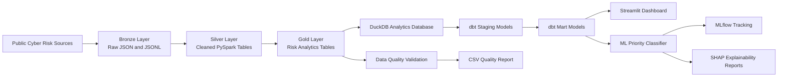

# Cyber Risk Intelligence Lakehouse + ML Explainability


A cyber risk intelligence lakehouse that ingests public vulnerability intelligence, transforms it through Bronze, Silver, and Gold layers using PySpark, builds SQL analytics marts with dbt and DuckDB, validates data quality, provides a Streamlit dashboard, and trains an explainable machine learning model for vulnerability priority classification.

This project is designed as a portfolio-grade end-to-end data product combining data engineering, analytics engineering, machine learning, explainability, and software engineering practices.

---

## Project Highlights

- Ingests public cyber risk data from CISA KEV, EPSS, and NVD CVE feeds.
- Builds a local lakehouse using Bronze, Silver, and Gold data layers.
- Uses PySpark for scalable ETL and data transformation.
- Creates analytics-ready Gold tables for vulnerability prioritisation, vendor risk, monthly trends, and CWE risk.
- Loads Gold tables into DuckDB for local analytical querying.
- Uses dbt to build staging views and analytics marts.
- Runs dbt tests for source and mart-level data validation.
- Exports a data quality report to CSV.
- Provides an interactive Streamlit dashboard for cyber risk analysis.
- Trains a Random Forest priority classifier using analytics mart data.
- Tracks ML experiments with MLflow.
- Explains model behaviour using feature importance and SHAP.
- Uses GitHub Actions for CI checks.

---

## Architecture



The project follows a layered data architecture. Raw public vulnerability data is ingested into the Bronze layer, cleaned into Silver PySpark tables, transformed into Gold analytics tables, loaded into DuckDB, modelled with dbt, visualised through Streamlit, and used for machine learning and explainability workflows.

---

## Data Sources

### CISA Known Exploited Vulnerabilities Catalog

CISA KEV provides a list of vulnerabilities that are known to be exploited in the wild. In this project, KEV is used to identify CVEs with confirmed exploitation evidence.

### EPSS Exploit Prediction Scoring System

EPSS provides probability-like exploitation signals. In this project, EPSS scores are used as an additional risk signal where available.

### NVD Recent CVE Feed

NVD provides CVE descriptions, CVSS severity scores, CWE categories, affected vendors and products, references, and attack vector metadata.

---

## Tech Stack

### Data Engineering

- Python
- PySpark
- Parquet
- JSON / JSONL
- Bronze, Silver, Gold lakehouse design

### Analytics Engineering

- DuckDB
- dbt
- SQL models
- Source tests
- Mart tests

### Dashboard and Reporting

- Streamlit
- Plotly
- CSV reports
- PNG report artifacts

### Machine Learning

- scikit-learn
- Random Forest Classifier
- MLflow
- SHAP
- joblib
- matplotlib

### Software Engineering

- Git
- GitHub
- GitHub Actions
- Modular Python scripts
- Local reproducible pipeline runner

---

## Project Structure

```text
cyber-risk-intelligence-lakehouse/
│
├── app/
│   └── dashboard.py
│
├── assets/
│   ├── dashboard_overview.png
│   ├── dashboard_risk_analysis.png
│   └── dashboard_top_vulnerabilities.png
│
├── data/
│   ├── bronze/
│   ├── silver/
│   └── gold/
│
├── dbt/
│   └── cyber_risk_dbt/
│       ├── dbt_project.yml
│       ├── profiles.yml
│       └── models/
│           ├── sources.yml
│           ├── staging/
│           └── marts/
│
├── ml/
│   └── train_priority_model.py
│
├── models/
│   └── priority_classifier.joblib
│
├── reports/
│   ├── data_quality_report.csv
│   ├── model_metrics.json
│   ├── classification_report.csv
│   ├── confusion_matrix.csv
│   ├── feature_importance.csv
│   ├── feature_importance.png
│   └── shap_feature_importance.png
│
├── scripts/
│   ├── run_ingestion.py
│   ├── build_analytics_database.py
│   ├── validate_lakehouse.py
│   ├── inspect_lakehouse.py
│   ├── run_dbt.py
│   ├── run_ml.py
│   └── run_pipeline.py
│
├── src/
│   └── cyber_risk/
│       ├── ingestion/
│       ├── etl/
│       └── quality/
│
├── .github/
│   └── workflows/
│       └── python-ci.yml
│
├── requirements.txt
├── pyproject.toml
└── README.md
```

Note: local generated data, DuckDB files, MLflow tracking files, and model binaries are excluded from Git where appropriate.

---

## Pipeline Overview

The full pipeline can be run with one command:

```bash
python scripts/run_pipeline.py
```

The pipeline runs:

```text
Bronze ingestion
→ Silver PySpark ETL
→ Gold analytics table build
→ Data quality validation
→ DuckDB analytics database build
→ dbt staging and mart models
→ dbt tests and docs generation
→ Lakehouse output inspection
```

A separate ML workflow can be run with:

```bash
python scripts/run_ml.py
```

The ML workflow runs:

```text
dbt analytics mart build
→ ML training data extraction
→ Random Forest model training
→ evaluation report generation
→ feature importance export
→ SHAP explainability export
→ MLflow experiment tracking
```

---

## Latest Validated Pipeline Output

The latest local run produced the following outputs:

```text
Silver KEV: 1,638 rows
Silver EPSS: 5,000 rows
Silver NVD: 7,479 rows

Gold Vulnerability Priority: 7,479 rows
Gold Vendor Risk Summary: 2,936 rows
Gold Monthly Vulnerability Trends: 2 rows
Gold CWE Risk Summary: 317 rows
```

Because the project ingests live public vulnerability feeds, row counts can change over time.

---

## Gold Analytics Tables

### vulnerability_priority

The main CVE-level risk table. It combines NVD CVE metadata, CVSS severity, EPSS signals, CISA KEV exploitation evidence, reference counts, affected product counts, and a calculated risk score.

### vendor_risk_summary

Aggregates cyber risk by vendor and product. This table supports vendor-level prioritisation and helps identify software suppliers with a higher concentration of risky vulnerabilities.

### monthly_vulnerability_trends

Aggregates vulnerability trends by published year and month. It supports monthly monitoring of CVE volume, severity, known exploitation, and network-exploitable vulnerabilities.

### cwe_risk_summary

Aggregates risk by CWE weakness category. It helps identify vulnerability classes that appear frequently or are associated with higher-risk CVEs.

---

## Risk Scoring Logic

The project calculates a combined risk score using multiple cyber risk signals:

- CVSS base score
- CVSS severity label
- EPSS score where available
- Known exploited status from CISA KEV
- Reference count
- Affected product count
- Attack vector and exploitability-related fields

The output is assigned into a priority level:

```text
High
Medium
Low
```

The priority level is used for dashboard filtering, analytics marts, and machine learning classification.

---

## Data Quality Validation

The validation workflow checks the Gold layer for common data quality issues:

- Required columns exist.
- CVE IDs are not missing.
- CVE IDs are unique.
- CVSS scores are within the expected range of 0 to 10.
- EPSS scores are within the expected range of 0 to 1.
- Risk scores are within the expected project range.
- Priority levels contain only valid labels.
- Known exploited flags are valid 0 or 1 values.
- Vendor, monthly trend, and CWE summary tables have valid row counts.

The latest validation result:

```text
PASS: 18
WARN: 0
FAIL: 0
```

A CSV quality report is exported to:

```text
reports/data_quality_report.csv
```

---

## dbt Analytics Layer

This project includes a dbt analytics engineering layer on top of the Gold PySpark tables.

The Gold tables are first loaded into a local DuckDB database:

```text
analytics/cyber_risk.duckdb
```

Then dbt builds staging views and mart tables.

### dbt Sources

```text
raw_vulnerability_priority
raw_vendor_risk_summary
raw_monthly_vulnerability_trends
raw_cwe_risk_summary
```

### dbt Staging Models

```text
stg_vulnerability_priority
stg_vendor_risk_summary
stg_monthly_vulnerability_trends
stg_cwe_risk_summary
```

### dbt Mart Models

```text
mart_vulnerability_priority
mart_vendor_risk_summary
mart_monthly_vulnerability_trends
mart_cwe_risk_summary
```

### dbt Test Result

The latest dbt build completed successfully:

```text
PASS=26
WARN=0
ERROR=0
SKIP=0
TOTAL=26
```

The dbt documentation site can be generated and served locally:

```bash
dbt docs generate --project-dir dbt/cyber_risk_dbt --profiles-dir dbt/cyber_risk_dbt
dbt docs serve --project-dir dbt/cyber_risk_dbt --profiles-dir dbt/cyber_risk_dbt
```

---

## Streamlit Dashboard

The Streamlit dashboard provides an interactive view of vulnerability risk intelligence.

Run it locally:

```bash
python -m streamlit run app/dashboard.py
```

Dashboard features include:

- Total CVE count
- Known exploited vulnerability count
- Average CVSS score
- Priority distribution
- Monthly vulnerability trend
- Vendor and product risk ranking
- CWE risk summary
- Top vulnerability table
- Filters for priority, severity, attack vector, vendor, and CWE

### Dashboard Screenshots


---

## Machine Learning Priority Classifier

The project trains a machine learning model to classify vulnerability priority levels using the dbt mart table `mart_vulnerability_priority`.

### Model Type

```text
Random Forest Classifier
```

### Target

```text
priority_level
```

### Input Features

The model uses vulnerability severity, exploitation evidence, weakness category, attack conditions, and reference metadata.

Key input features include:

- `cvss_base_score`
- `cvss_base_severity`
- `is_known_exploited`
- `reference_count`
- `affected_entry_count`
- `published_month`
- `attack_vector`
- `attack_complexity`
- `privileges_required`
- `user_interaction`
- `cwe_id`

### Latest Model Metrics

```text
Training rows: 5,609
Test rows: 1,870
Accuracy: 0.9856
Balanced Accuracy: 0.8232
Macro F1: 0.8793
Weighted F1: 0.9855
```

The dataset is highly imbalanced. In the latest run, the target distribution was:

```text
Medium: 4,188
Low: 3,283
High: 8
```

Because the High-priority class has very few examples, accuracy alone is not enough to evaluate the model. Balanced accuracy and macro F1 are reported alongside overall accuracy to provide a more honest evaluation across classes.

---

## Model Feature Importance


This chart shows which input features the Random Forest model relied on most when predicting vulnerability priority levels.

The most influential feature is `cvss_base_score`, which means the model heavily depends on the technical severity of a vulnerability. Other important signals include whether the CVE is known to be exploited, CVSS severity labels, CWE weakness categories, and the number of public references.

In practical terms, the model learned that higher-priority vulnerabilities are usually associated with stronger severity scores, known exploitation evidence, and specific weakness categories.

### Key Feature Meanings

- `cvss_base_score`: Technical severity score of the vulnerability.
- `is_known_exploited`: Whether the vulnerability appears in the CISA KEV known exploited catalog.
- `cvss_base_severity`: CVSS severity label such as Critical, High, Medium, or Low.
- `cwe_id`: Common Weakness Enumeration category, representing the vulnerability weakness type.
- `reference_count`: Number of external references linked to the CVE.
- `affected_entry_count`: Number of affected vendor/product entries extracted from the CVE record.
- `attack_vector`: Whether the vulnerability can be exploited over the network, locally, physically, or through another vector.
- `attack_complexity`: How difficult exploitation is under expected conditions.
- `privileges_required`: Whether exploitation requires attacker privileges.
- `user_interaction`: Whether exploitation requires a user to take an action.

---

## SHAP Explainability


SHAP explains how much each feature contributes to the model's predictions on average.

The SHAP results show that `cvss_base_score`, CVSS severity, known exploitation status, user interaction, attack vector, and reference count are the strongest drivers of the model's vulnerability priority predictions.

This makes the model more interpretable because the prediction is not treated as a black box. Instead, the project can explain why certain vulnerabilities are prioritised higher than others.

For example:

- A higher CVSS base score usually increases predicted risk.
- A known exploited CVE is more likely to receive a higher priority.
- Network-exploitable vulnerabilities can contribute to higher risk.
- User interaction and privilege requirements help the model understand exploitability conditions.
- CWE categories help the model capture recurring weakness patterns.

---

## MLflow Experiment Tracking

MLflow is used to track model training runs, parameters, metrics, model artifacts, and output reports.

The local MLflow tracking directory is:

```text
mlruns/
```

To open the MLflow UI locally:

```bash
mlflow ui --backend-store-uri ./mlruns --port 5000
```

Then open:

```text
http://localhost:5000
```

The current experiment is:

```text
cyber-risk-priority-classifier
```

MLflow outputs are kept local and are not committed to Git.

---

## Generated Reports

The project generates the following reporting artifacts:

```text
reports/data_quality_report.csv
reports/model_metrics.json
reports/classification_report.csv
reports/confusion_matrix.csv
reports/feature_importance.csv
reports/feature_importance.png
reports/shap_feature_importance.png
```

These reports support both engineering validation and machine learning explainability.

---

## Run the Project Locally

### 1. Clone the repository

```bash
git clone https://github.com/momo840505/cyber-risk-intelligence-lakehouse.git
cd cyber-risk-intelligence-lakehouse
```

### 2. Create and activate a virtual environment

```bash
python -m venv .venv
```

On Windows PowerShell:

```powershell
.\.venv\Scripts\Activate.ps1
```

### 3. Install dependencies

```bash
python -m pip install --upgrade pip
python -m pip install -r requirements.txt
```

### 4. Run the full lakehouse pipeline

```bash
python scripts/run_pipeline.py
```

### 5. Run the ML workflow

```bash
python scripts/run_ml.py
```

### 6. Start the Streamlit dashboard

```bash
python -m streamlit run app/dashboard.py
```

### 7. Start the MLflow UI

```bash
mlflow ui --backend-store-uri ./mlruns --port 5000
```

---

## GitHub Actions CI

This repository includes a GitHub Actions workflow that checks Python source files and validates that the project package can be imported.

The latest workflow runs passed successfully after adding:

- Pipeline runner
- Data quality report
- dbt analytics layer
- ML priority classifier
- SHAP reports
- MLflow tracking support

---

## Current Project Status

Completed:

- PySpark ingestion and ETL
- Bronze, Silver, and Gold lakehouse layers
- CISA KEV, EPSS, and NVD CVE integration
- Gold analytics tables
- Data quality validation
- CSV quality report
- Streamlit dashboard
- Dashboard screenshots
- DuckDB analytics database
- dbt sources, staging models, and mart models
- dbt tests and docs generation
- ML priority classifier
- MLflow tracking
- SHAP explainability reports
- GitHub Actions CI

Planned next phases:

- FastAPI risk intelligence API
- Prediction endpoint for vulnerability priority
- RAG-based remediation copilot
- LLM evaluation
- Monitoring and observability
- Terraform infrastructure templates
- AWS deployment architecture

---

## Limitations

- The current project runs locally and has not yet been deployed to AWS.
- Public vulnerability feeds change over time, so row counts and model outputs may vary between runs.
- The current ML classifier is trained on a highly imbalanced target distribution, especially for the High-priority class.
- The model currently supports portfolio-grade explainability through SHAP, but it should not be used as a production security decision system without additional validation.
- MLflow tracking is local and not yet deployed to a remote tracking server.
- The model predicts project-defined priority labels, not official CVSS severity labels.

---

## Future Roadmap

### Phase 4: FastAPI Risk Intelligence API

Planned API endpoints:

```text
GET /health
GET /vulnerabilities/top
GET /vulnerabilities/{cve_id}
GET /vendors/risk-summary
GET /cwe/risk-summary
GET /trends/monthly
POST /predict-priority
```

### Phase 5: RAG Remediation Copilot

Planned capabilities:

- Retrieve relevant CVE, CWE, KEV, and remediation context.
- Generate concise remediation guidance.
- Return grounded answers with source context.
- Avoid exploit instructions and focus on defensive remediation.

### Phase 6: Cloud and Infrastructure

Planned capabilities:

- AWS S3 data lake architecture
- Terraform templates
- Containerised API deployment
- Monitoring and logging
- CI/CD deployment workflow

---

## Portfolio Summary

This project demonstrates practical skills across the modern data and AI engineering stack:

- Data ingestion from public APIs
- PySpark ETL
- Lakehouse architecture
- Data quality validation
- dbt analytics engineering
- SQL marts
- Streamlit dashboards
- Machine learning model training
- Model evaluation
- SHAP explainability
- MLflow experiment tracking
- GitHub Actions CI
- Security-aware data product design

---

## Author

**Wei-Ting Mo**  
Master of Data Science  
GitHub: [momo840505](https://github.com/momo840505)
