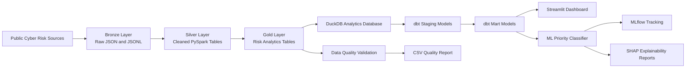

# Cyber Risk Intelligence Lakehouse + ML Prioritisation


A production-style cyber risk intelligence project that ingests public vulnerability intelligence, builds a Bronze / Silver / Gold lakehouse with PySpark, transforms analytics marts with dbt and DuckDB, validates data quality, visualises cyber risk in Streamlit, and trains an explainable machine learning classifier with MLflow and SHAP.

---

## 🚀 Project Overview

This project simulates an end-to-end cyber risk intelligence platform for vulnerability prioritisation.

It combines data engineering, analytics engineering, dashboarding, machine learning, model explainability, and CI automation in one portfolio-ready repository.

The pipeline ingests and combines:

- **CISA KEV** — Known Exploited Vulnerabilities
- **FIRST EPSS** — Exploit Prediction Scoring System
- **NVD CVE** — Recent vulnerability records, CVSS severity, CWE, affected products, and references

The final output helps answer questions such as:

- Which vulnerabilities should be prioritised first?
- Which vendors and products carry the highest cyber risk?
- Which CWE categories are most associated with high-risk vulnerabilities?
- How are vulnerabilities changing month by month?
- Which features drive machine learning priority predictions?

---

## ✅ What This Project Demonstrates

| Area | Implemented |
|---|---|
| Data ingestion | Public cyber risk APIs and JSON/JSONL outputs |
| Data lakehouse | Bronze, Silver, and Gold data layers |
| Distributed processing | PySpark ETL pipeline |
| Analytics engineering | dbt models, tests, and documentation |
| Local warehouse | DuckDB analytics database |
| Data quality | Automated validation report |
| Dashboard | Streamlit + Plotly interactive dashboard |
| Machine learning | Random Forest priority classifier |
| Model explainability | SHAP feature importance |
| Experiment tracking | MLflow local tracking |
| CI/CD foundation | GitHub Actions Python CI |
| Portfolio readiness | Professional README, screenshots, reports, and release history |

---

## 🧱 Architecture



---

## 📦 Data Sources

### CISA Known Exploited Vulnerabilities

Used to identify vulnerabilities that are already known to be exploited in the wild.

Main fields used:

- CVE ID
- Vendor / project
- Product
- Date added
- Due date
- Required action
- Known ransomware campaign use
- CWE list

### FIRST EPSS

Used as an exploitation probability signal.

Main fields used:

- CVE ID
- EPSS score
- EPSS percentile
- EPSS date

### NVD CVE

Used as the main vulnerability detail source.

Main fields used:

- CVE ID
- Published date
- Last modified date
- Description
- CVSS score
- CVSS severity
- Attack vector
- Attack complexity
- Privileges required
- User interaction
- CWE ID
- Affected vendor
- Affected product
- Reference count

---

## 🏗️ Lakehouse Layers

### Bronze Layer

Raw ingested files are stored without transformation.

```text
data/bronze/
├── kev/
├── epss/
└── nvd/
```

### Silver Layer

PySpark cleans and standardises source data into structured Parquet tables.

```text
data/silver/
├── kev/
├── epss/
└── nvd/
```

Latest validated Silver output:

| Table | Rows | Columns |
|---|---:|---:|
| Silver KEV | 1,638 | 13 |
| Silver EPSS | 5,000 | 6 |
| Silver NVD | 7,479 | 26 |

### Gold Layer

Gold tables are analytics-ready outputs used by validation, dashboarding, dbt, and machine learning.

```text
data/gold/
├── vulnerability_priority/
├── vendor_risk_summary/
├── monthly_vulnerability_trends/
└── cwe_risk_summary/
```

Latest validated Gold output:

| Table | Rows | Description |
|---|---:|---|
| vulnerability_priority | 7,479 | CVE-level risk priority table |
| vendor_risk_summary | 2,936 | Vendor and product-level risk summary |
| monthly_vulnerability_trends | 2 | Monthly vulnerability trend summary |
| cwe_risk_summary | 317 | CWE-level risk summary |

> Row counts may change because the project ingests live public vulnerability data.

---

## 🧮 Risk Scoring Logic

The Gold vulnerability priority table combines multiple risk signals:

- CVSS base score
- CVSS severity
- EPSS score and percentile
- Known exploited vulnerability flag
- Attack vector
- Privileges required
- User interaction
- Reference count
- Affected product count

Priority levels are assigned as:

```text
Critical
High
Medium
Low
```

Latest priority distribution:

| Priority | Count |
|---|---:|
| High | 8 |
| Medium | 4,188 |
| Low | 3,283 |

---

## 🧪 Data Quality Validation

The project includes automated data quality checks for Gold tables.

Validation checks include:

- Row count checks
- Required column checks
- Missing CVE ID checks
- Duplicate CVE ID checks
- CVSS score range checks
- EPSS score range checks
- Risk score range checks
- Priority level validity checks
- Known exploited flag checks
- Vendor/product summary checks
- Monthly trend checks
- CWE missing value checks

Latest validation result:

```text
PASS: 18
WARN: 0
FAIL: 0
```

Validation output:

```text
reports/data_quality_report.csv
```

Run validation:

```powershell
python .\scripts\validate_lakehouse.py
```

---

## 🧱 dbt Analytics Layer

The project uses DuckDB as a local analytics warehouse and dbt for SQL-based analytics engineering.

### DuckDB Database

```text
analytics/cyber_risk.duckdb
```

The DuckDB database is generated locally and ignored by Git.

### dbt Project

```text
dbt/cyber_risk_dbt/
├── dbt_project.yml
├── profiles.yml
└── models/
    ├── sources.yml
    ├── staging/
    └── marts/
```

### dbt Models

| Layer | Models |
|---|---|
| Sources | `raw_vulnerability_priority`, `raw_vendor_risk_summary`, `raw_monthly_vulnerability_trends`, `raw_cwe_risk_summary` |
| Staging | `stg_vulnerability_priority`, `stg_vendor_risk_summary`, `stg_monthly_vulnerability_trends`, `stg_cwe_risk_summary` |
| Marts | `mart_vulnerability_priority`, `mart_vendor_risk_summary`, `mart_monthly_vulnerability_trends`, `mart_cwe_risk_summary` |

Latest dbt build result:

```text
PASS=26
WARN=0
ERROR=0
SKIP=0
TOTAL=26
```

Run dbt workflow:

```powershell
python .\scripts\run_dbt.py
```

Open dbt documentation:

```powershell
dbt docs serve --project-dir dbt\cyber_risk_dbt --profiles-dir dbt\cyber_risk_dbt
```

---

## 📊 Streamlit Dashboard

The project includes an interactive dashboard for cyber risk exploration.

Run locally:

```powershell
python -m streamlit run app\dashboard.py
```

Dashboard features:

- Executive KPI cards
- Priority distribution
- CVSS and risk score distribution
- Vendor risk summary
- CWE risk ranking
- Monthly vulnerability trends
- Top vulnerability table
- Interactive filters

### Dashboard Screenshots


---

## 🤖 Machine Learning Priority Classifier

The project trains a machine learning model to classify vulnerability priority levels.

### Model

```text
RandomForestClassifier
```

### Target

```text
priority_level
```

Classes:

```text
High
Medium
Low
```

### Features

Numeric features:

- CVSS base score
- EPSS score
- EPSS percentile
- Known exploited flag
- Reference count
- Affected entry count
- Published month

Categorical features:

- CVSS severity
- Attack vector
- Attack complexity
- Privileges required
- User interaction
- CWE ID

### Latest Training Output

| Metric | Value |
|---|---:|
| Training rows | 5,609 |
| Test rows | 1,870 |
| Accuracy | 0.9856 |
| Balanced accuracy | 0.8232 |
| Macro F1 | 0.8793 |
| Weighted F1 | 0.9855 |

Target distribution:

| Priority | Count |
|---|---:|
| Medium | 4,188 |
| Low | 3,283 |
| High | 8 |

The dataset is highly imbalanced, with only 8 High-priority vulnerabilities in the latest run. Therefore, balanced accuracy and macro F1 are reported alongside overall accuracy.

Run ML workflow:

```powershell
python .\scripts\run_ml.py
```

---

## 🔍 Model Explainability with SHAP

The project uses SHAP-style feature attribution to explain which features influence model predictions most strongly.

Top SHAP features from the latest run:

| Feature | Mean Absolute SHAP Value |
|---|---:|
| cvss_base_score | 0.091764 |
| cvss_base_severity_MEDIUM | 0.040917 |
| cvss_base_severity_HIGH | 0.039778 |
| is_known_exploited | 0.035003 |
| cvss_base_severity_CRITICAL | 0.031291 |
| user_interaction_NONE | 0.026483 |
| cwe_id_CWE-434 | 0.018896 |
| user_interaction_REQUIRED | 0.017701 |
| reference_count | 0.017388 |
| attack_vector_NETWORK | 0.016585 |

### Feature Importance


### SHAP Feature Importance


Generated files:

```text
reports/model_metrics.json
reports/classification_report.csv
reports/confusion_matrix.csv
reports/feature_importance.csv
reports/feature_importance.png
reports/shap_feature_importance.png
```

The trained local model is saved to:

```text
models/priority_classifier.joblib
```

The model artifact is ignored by Git to keep the repository lightweight.

---

## 📈 MLflow Experiment Tracking

MLflow is used to track the model experiment locally.

MLflow records:

- Model parameters
- Model metrics
- Classification report
- Confusion matrix
- Feature importance outputs
- SHAP importance plot
- Serialized model artifact

Run MLflow UI:

```powershell
mlflow ui --backend-store-uri .\mlruns --port 5000
```

Then open:

```text
http://localhost:5000
```

Local MLflow tracking files are stored in:

```text
mlruns/
```

This directory is ignored by Git.

---

## 🔁 Full Pipeline

The full pipeline runs ingestion, PySpark ETL, validation, dbt analytics, and inspection.

Run the full pipeline:

```powershell
python .\scripts\run_pipeline.py
```

Pipeline steps:

```text
Bronze ingestion
→ Silver ETL
→ Gold ETL
→ Data Quality Validation
→ DuckDB Analytics Database
→ dbt Staging + Mart Models
→ dbt Tests
→ dbt Docs
→ Lakehouse Inspection
```

Latest full pipeline result:

```text
Pipeline completed successfully.
```

---

## ⚙️ GitHub Actions CI

The repository includes a GitHub Actions workflow for Python CI.

The CI workflow checks:

- Python setup
- Dependency installation
- Project package installation
- Python source compilation
- Package import validation

Latest workflow status:

```text
Passing
```

Workflow file:

```text
.github/workflows/python-ci.yml
```

---

## 📁 Project Structure

```text
cyber-risk-intelligence-lakehouse/
├── .github/
│   └── workflows/
│       └── python-ci.yml
├── app/
│   └── dashboard.py
├── assets/
│   ├── dashboard_overview.png
│   ├── dashboard_risk_analysis.png
│   └── dashboard_top_vulnerabilities.png
├── dbt/
│   └── cyber_risk_dbt/
│       ├── dbt_project.yml
│       ├── profiles.yml
│       └── models/
│           ├── sources.yml
│           ├── staging/
│           └── marts/
├── ml/
│   └── train_priority_model.py
├── reports/
│   ├── data_quality_report.csv
│   ├── model_metrics.json
│   ├── classification_report.csv
│   ├── confusion_matrix.csv
│   ├── feature_importance.csv
│   ├── feature_importance.png
│   └── shap_feature_importance.png
├── scripts/
│   ├── run_ingestion.py
│   ├── run_pipeline.py
│   ├── run_dbt.py
│   ├── run_ml.py
│   ├── build_analytics_database.py
│   ├── inspect_lakehouse.py
│   └── validate_lakehouse.py
├── src/
│   └── cyber_risk/
│       ├── ingestion/
│       ├── etl/
│       └── quality/
├── requirements.txt
├── pyproject.toml
└── README.md
```

Generated local folders not committed to Git:

```text
data/
analytics/
models/
mlruns/
dbt/cyber_risk_dbt/target/
dbt/cyber_risk_dbt/logs/
```

---

## 🛠️ Local Setup

### 1. Clone the Repository

```powershell
git clone https://github.com/momo840505/cyber-risk-intelligence-lakehouse.git
cd cyber-risk-intelligence-lakehouse
```

### 2. Create Virtual Environment

```powershell
python -m venv .venv
.\.venv\Scripts\Activate.ps1
```

### 3. Install Dependencies

```powershell
python -m pip install --upgrade pip
python -m pip install -r requirements.txt
python -m pip install -e .
```

### 4. Configure Hadoop on Windows

PySpark on Windows requires Hadoop winutils.

Expected local setup:

```powershell
$env:HADOOP_HOME = "C:\hadoop"
$env:Path = "C:\hadoop\bin;$env:Path"
```

Check:

```powershell
Test-Path C:\hadoop\bin
Test-Path C:\hadoop\bin\winutils.exe
where.exe winutils
```

---

## ▶️ How to Run

### Run Full Data Pipeline

```powershell
python .\scripts\run_pipeline.py
```

### Run dbt Analytics Layer

```powershell
python .\scripts\run_dbt.py
```

### Run ML Training

```powershell
python .\scripts\run_ml.py
```

### Run Dashboard

```powershell
python -m streamlit run app\dashboard.py
```

### Open MLflow UI

```powershell
mlflow ui --backend-store-uri .\mlruns --port 5000
```

---

## 📌 Current Project Status

Completed:

```text
✅ Public cyber risk data ingestion
✅ Bronze / Silver / Gold lakehouse
✅ PySpark ETL
✅ Gold analytics tables
✅ Data quality validation
✅ Data quality CSV report
✅ Streamlit dashboard
✅ Dashboard screenshots
✅ DuckDB analytics database
✅ dbt source models
✅ dbt staging models
✅ dbt mart models
✅ dbt tests
✅ dbt docs
✅ Machine learning priority classifier
✅ SHAP explainability
✅ MLflow experiment tracking
✅ Model metrics and plots
✅ GitHub Actions CI
```

Not implemented yet:

```text
❌ FastAPI service
❌ RAG remediation copilot
❌ LLM evaluation
❌ Cloud deployment
❌ Terraform infrastructure
❌ Production monitoring
```

---

## 🧭 Roadmap

### Phase 4 — FastAPI Risk Intelligence API

Planned endpoints:

```text
GET /health
GET /vulnerabilities/top
GET /vulnerabilities/{cve_id}
GET /vendors/risk-summary
GET /cwe/risk-summary
GET /trends/monthly
POST /predict-priority
```

### Phase 5 — AI Remediation Copilot

Planned features:

```text
RAG-based remediation guidance
CVE-specific recommended actions
Source-grounded cyber risk summaries
LLM output safety checks
LLM evaluation report
```

### Phase 6 — Cloud and Infrastructure

Planned features:

```text
AWS S3 lakehouse storage
Terraform infrastructure templates
Containerised API deployment
CloudWatch-style monitoring design
CI/CD deployment workflow
```

---

## ⚠️ Notes and Limitations

- Public vulnerability datasets update frequently, so row counts and model metrics may change between runs.
- The latest ML dataset is imbalanced, especially for the High-priority class.
- The current ML model is a portfolio-grade explainability demonstration, not a production cyber risk decision engine.
- Local DuckDB, MLflow, and model artifacts are intentionally ignored by Git.
- AWS, FastAPI, RAG, Terraform, and monitoring are planned future phases, not yet implemented.

---

## 👤 Author

**Mo Mo**  
Master of Data Science student  
GitHub: [momo840505](https://github.com/momo840505)

---

## ⭐ Summary

This repository demonstrates a modern cyber risk intelligence workflow:

```text
Public vulnerability intelligence
→ PySpark lakehouse
→ dbt analytics marts
→ Data quality validation
→ Streamlit dashboard
→ ML priority classifier
→ SHAP explainability
→ MLflow experiment tracking
→ GitHub Actions CI
```
