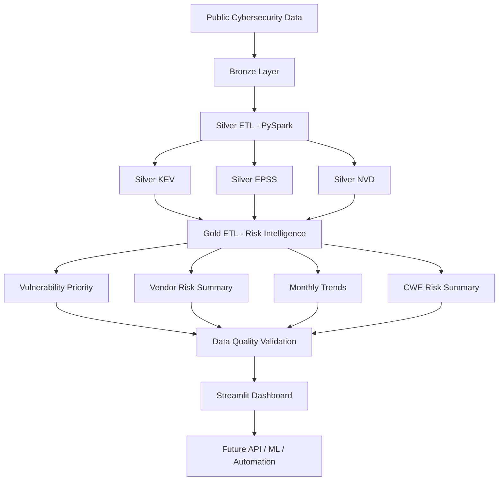

# 🛡️ Cyber Risk Intelligence Lakehouse


A PySpark-based cyber risk intelligence lakehouse for collecting, cleaning, transforming, validating, and analysing public vulnerability intelligence data.

This project combines **CVE**, **CVSS**, **EPSS**, and **CISA Known Exploited Vulnerabilities** signals into analytics-ready Gold tables for vulnerability prioritisation, vendor risk analysis, CWE weakness summaries, monthly vulnerability trend monitoring, automated data quality validation, and an interactive Streamlit dashboard.

---

## 📌 Project Overview

Cybersecurity teams often need to prioritise thousands of vulnerabilities across many vendors and products. Raw vulnerability feeds are useful, but they are usually fragmented across different sources and are not immediately ready for analysis.

This project builds a local data lakehouse pipeline that turns raw cybersecurity data into structured, validated, queryable, and dashboard-ready datasets.

The pipeline follows a classic **Bronze → Silver → Gold → Validation → Dashboard** architecture:

```text
Bronze Layer  →  Silver Layer  →  Gold Layer  →  Data Quality  →  Dashboard
Raw data         Clean data       Analytics       Validation       Visual insights
```

---

## 🎯 Project Goals

- Ingest public cybersecurity vulnerability datasets.
- Store raw records in a local Bronze layer.
- Clean and standardise vulnerability data with PySpark.
- Build Silver tables for KEV, EPSS, and NVD data.
- Join multiple vulnerability intelligence sources.
- Create Gold tables for risk scoring and reporting.
- Validate Gold table quality using automated data checks.
- Export a data quality report as CSV.
- Build an interactive Streamlit dashboard for vulnerability exploration.
- Provide a one-command pipeline runner for the full local workflow.
- Add GitHub Actions CI for basic package, syntax, and import checks.

---

## 🧠 Why This Project Matters

Not all vulnerabilities should be prioritised in the same way.

A vulnerability may have a high CVSS score, but it may not be likely to be exploited. Another vulnerability may have a lower severity score, but it may already be actively exploited in the real world.

This project combines multiple risk signals:

- **CVSS**: technical severity
- **EPSS**: probability of exploitation
- **CISA KEV**: known real-world exploitation
- **NVD metadata**: vendor, product, CWE, attack vector, and publication information

By combining these signals, the project supports a more practical vulnerability prioritisation workflow.

---

## 🏗️ Lakehouse Architecture



### Architecture Summary

```text
Public Cybersecurity Sources
        |
        v
Bronze Layer
Raw KEV, EPSS, and NVD data
        |
        v
Silver Layer
Cleaned and standardised vulnerability tables
        |
        v
Gold Layer
Analytics-ready cyber risk intelligence tables
        |
        v
Data Quality Validation
Schema, completeness, range, and consistency checks
        |
        v
Streamlit Dashboard
Interactive cyber risk exploration
```

---

## 🗂️ Data Sources

### 1. CISA Known Exploited Vulnerabilities

Used to identify vulnerabilities that are known to have been exploited in the real world.

Main information includes:

- CVE ID
- Vendor or project
- Product
- Vulnerability name
- Date added
- Due date
- Required action
- Known ransomware campaign use

---

### 2. FIRST EPSS

Used to estimate how likely a vulnerability is to be exploited.

Main information includes:

- CVE ID
- EPSS score
- EPSS percentile
- EPSS date

---

### 3. NVD CVE Data

Used to extract vulnerability metadata, CVSS scores, affected vendors/products, CWE categories, and publication dates.

Main information includes:

- CVE ID
- Published date
- Last modified date
- Vulnerability description
- CWE ID
- Affected vendor
- Affected product
- CVSS score
- CVSS severity
- CVSS vector string
- Attack vector
- Attack complexity
- User interaction
- Impact metrics

---

## 📁 Project Structure

```text
cyber-risk-intelligence-lakehouse/
│
├── .github/
│   └── workflows/
│       └── python-ci.yml
│
├── app/
│   └── dashboard.py
│
├── assets/
│   ├── dashboard_overview.png
│   ├── dashboard_risk_analysis.png
│   └── dashboard_top_vulnerabilities.png
│
├── reports/
│   └── data_quality_report.csv
│
├── scripts/
│   ├── inspect_lakehouse.py
│   ├── run_ingestion.py
│   ├── run_pipeline.py
│   └── validate_lakehouse.py
│
├── src/
│   └── cyber_risk/
│       ├── __init__.py
│       ├── config.py
│       │
│       ├── ingestion/
│       │   ├── __init__.py
│       │   ├── download_epss.py
│       │   ├── download_kev.py
│       │   ├── download_nvd_recent.py
│       │   └── http_client.py
│       │
│       ├── etl/
│       │   ├── __init__.py
│       │   ├── spark_session.py
│       │   ├── build_silver_tables.py
│       │   └── build_gold_tables.py
│       │
│       └── quality/
│           ├── __init__.py
│           └── validate_gold_tables.py
│
├── .gitignore
├── pyproject.toml
├── requirements.txt
└── README.md
```

---

## 🥉 Bronze Layer

The Bronze layer stores raw downloaded cybersecurity data.

Expected local folder:

```text
data/bronze/
```

Example raw data folders:

```text
data/bronze/kev/
data/bronze/epss/
data/bronze/nvd/
```

The Bronze layer is excluded from Git because it contains generated local data files.

---

## 🥈 Silver Layer

The Silver layer contains cleaned and standardised datasets.

Generated Silver tables:

```text
data/silver/silver_kev
data/silver/silver_epss
data/silver/silver_nvd
```

Latest validated Silver output:

```text
Silver KEV: 1,638 rows
Silver EPSS: 5,000 rows
Silver NVD: 7,477 rows
```

### Silver KEV Table

Purpose: clean and standardise known exploited vulnerability records.

Important fields:

```text
cve_id
vendor_project
product
vulnerability_name
date_added
due_date
known_ransomware_campaign_use
required_action
short_description
notes
cwe_list
date_added_year
date_added_month
```

### Silver EPSS Table

Purpose: clean and standardise exploit probability scores.

Important fields:

```text
cve_id
epss_score
epss_percentile
epss_date
epss_year
epss_month
```

### Silver NVD Table

Purpose: clean and standardise CVE metadata, CVSS severity, CWE category, and affected products.

Important fields:

```text
cve_id
source_identifier
published_datetime
last_modified_datetime
vulnerability_status
description
cwe_id
affected_vendor
affected_product
affected_entry_count
reference_count
cvss_version
cvss_base_score
cvss_base_severity
cvss_vector_string
attack_vector
attack_complexity
privileges_required
user_interaction
confidentiality_impact
integrity_impact
availability_impact
published_date
last_modified_date
published_year
published_month
```

---

## 🥇 Gold Layer

The Gold layer contains analytics-ready cyber risk intelligence tables.

Generated Gold tables:

```text
data/gold/vulnerability_priority
data/gold/vendor_risk_summary
data/gold/monthly_vulnerability_trends
data/gold/cwe_risk_summary
```

Latest validated Gold output:

```text
Gold Vulnerability Priority: 7,477 rows
Gold Vendor Risk Summary: 2,935 rows
Gold Monthly Trends: 2 rows
Gold CWE Risk Summary: 317 rows
```

> Note: The row counts can change over time because the project ingests live public vulnerability feeds, including recent NVD data and current EPSS scores.

---

## 📊 Gold Table 1: Vulnerability Priority

This is the main analytics table.

It combines:

- NVD vulnerability metadata
- CVSS severity information
- EPSS exploitation probability
- CISA KEV known exploited status
- Vendor and product information
- Risk score
- Priority level

Important fields:

```text
cve_id
published_date
last_modified_date
vulnerability_status
description
cwe_id
vendor
product_name
cvss_version
cvss_base_score
cvss_base_severity
cvss_vector_string
attack_vector
attack_complexity
privileges_required
user_interaction
confidentiality_impact
integrity_impact
availability_impact
epss_date
epss_score
epss_percentile
is_known_exploited
known_ransomware_campaign_use
date_added
due_date
required_action
risk_score
priority_level
reference_count
affected_entry_count
published_year
published_month
```

Example use cases:

- Find the highest priority vulnerabilities.
- Identify known exploited vulnerabilities.
- Combine severity and exploit probability.
- Support patch prioritisation decisions.

---

## 🏢 Gold Table 2: Vendor Risk Summary

This table aggregates vulnerability risk by vendor and product.

Important fields:

```text
vendor
product_name
total_vulnerabilities
known_exploited_count
average_risk_score
maximum_risk_score
average_epss_score
critical_count
high_count
```

Example use cases:

- Identify vendors with high-risk products.
- Compare products by vulnerability concentration.
- Support vendor-level cyber risk reporting.

---

## 📅 Gold Table 3: Monthly Vulnerability Trends

This table summarises vulnerability activity by year and month.

Important fields:

```text
published_year
published_month
total_cve_count
known_exploited_count
average_cvss_score
average_epss_score
critical_count
high_count
network_attack_vector_count
```

Latest monthly trend output:

```text
2026-06: 4,578 CVEs
2026-07: 2,899 CVEs
```

Example use cases:

- Track vulnerability publication volume over time.
- Monitor monthly critical and high severity counts.
- Identify changes in network-based attack exposure.

---

## 🧬 Gold Table 4: CWE Risk Summary

This table aggregates vulnerability risk by CWE weakness category.

Important fields:

```text
cwe_id
total_vulnerabilities
known_exploited_count
average_risk_score
maximum_risk_score
average_cvss_score
average_epss_score
```

Example use cases:

- Identify common weakness categories.
- Compare CWE groups by risk score.
- Support secure development and remediation planning.

---

## 🧮 Risk Scoring Logic

The project uses a practical scoring approach that combines multiple vulnerability signals.

Main signals:

```text
CVSS base score
EPSS exploit probability
Known exploited status
Reference count
Affected product information
```

Conceptual logic:

```text
Risk Score = severity signal + exploitability signal + known exploitation signal + exposure context
```

The final risk score is mapped into priority levels:

```text
Critical
High
Medium
Low
```

Latest priority distribution:

```text
High: 8
Medium: 4,178
Low: 3,291
```

This makes it easier to focus on vulnerabilities that are severe, likely to be exploited, or already known to be exploited.

---

## ✅ Data Quality Validation

This project includes automated validation checks for the Gold layer tables.

Validation script:

```text
scripts/validate_lakehouse.py
```

Core validation module:

```text
src/cyber_risk/quality/validate_gold_tables.py
```

Generated report:

```text
reports/data_quality_report.csv
```

### Validation Checks

The data quality validation checks include:

- Gold table existence
- Required column presence
- Non-empty table row counts
- Missing CVE ID checks
- Duplicate CVE ID checks
- CVSS score range validation
- EPSS score range validation
- Risk score range validation
- Priority level value validation
- Known exploited flag validation
- Vendor/product summary count validation
- Monthly trend month value validation
- CWE missing value validation

### Run Data Quality Validation

After building the Gold tables, run:

```powershell
python .\scripts\validate_lakehouse.py
```

### Latest Validation Result

```text
PASS: 18
WARN: 0
FAIL: 0
```

This confirms that the Gold layer outputs passed schema, completeness, consistency, and range checks.

---

## 📊 Streamlit Dashboard

This project includes an interactive Streamlit dashboard for exploring the Gold layer cyber risk intelligence tables.

The dashboard reads from:

```text
data/gold/vulnerability_priority
data/gold/vendor_risk_summary
data/gold/monthly_vulnerability_trends
data/gold/cwe_risk_summary
```

### Dashboard Features

- Executive KPI cards for total CVEs, Critical vulnerabilities, High vulnerabilities, known exploited vulnerabilities, and average risk score
- Priority distribution chart
- CVSS severity distribution chart
- Monthly vulnerability trend chart
- Top vendor and product risk ranking
- CWE weakness risk analysis
- Top priority vulnerability explorer
- Sidebar filters for priority level, attack vector, vendor keyword, known exploited status, and minimum risk score
- CSV download for top priority vulnerabilities

### Dashboard Screenshots

#### Executive Overview


#### Risk, Trend, Vendor, and CWE Analysis


#### Top Priority Vulnerabilities


### Run the Dashboard

After building the Gold tables, run:

```powershell
python -m streamlit run app\dashboard.py
```

The dashboard opens locally at:

```text
http://localhost:8501
```

---

## 🔁 One-Command Pipeline Runner

The project includes a one-command pipeline runner that executes the full local workflow:

```text
Ingestion → Silver ETL → Gold ETL → Data Quality Validation → Lakehouse Inspection
```

Run:

```powershell
python .\scripts\run_pipeline.py
```

This is useful for rebuilding the complete local lakehouse workflow from a single command.

---

## ⚙️ Continuous Integration

This repository includes a GitHub Actions workflow:

```text
.github/workflows/python-ci.yml
```

The workflow checks that:

- Python dependencies can be installed
- the project package can be installed
- source files compile successfully
- the main package can be imported

---

## ✅ Latest Validated Pipeline Output

The lakehouse pipeline has been validated locally.

### Bronze Ingestion

```text
Downloaded KEV catalog: 1,638 records
Downloaded EPSS records: 5,000
Downloaded NVD CVE records: 7,477
```

### Silver Tables

```text
Silver KEV
Rows: 1,638
Columns: 13

Silver EPSS
Rows: 5,000
Columns: 6

Silver NVD
Rows: 7,477
Columns: 26
```

### Gold Tables

```text
Gold Vulnerability Priority
Rows: 7,477
Columns: 33

Gold Vendor Risk Summary
Rows: 2,935
Columns: 9

Gold Monthly Trends
Rows: 2
Columns: 9

Gold CWE Risk Summary
Rows: 317
Columns: 7
```

### Data Quality

```text
PASS: 18
WARN: 0
FAIL: 0
```

---

## ⚙️ Tech Stack

| Category | Tools |
|---|---|
| Language | Python |
| Data Processing | PySpark |
| Validation | Pandas-based data quality checks |
| Dashboard | Streamlit, Plotly |
| Storage Format | Parquet |
| Architecture | Bronze, Silver, Gold Lakehouse |
| Data Sources | CISA KEV, FIRST EPSS, NVD CVE data |
| CI/CD | GitHub Actions |
| Development | Git, GitHub, Virtual Environment |
| Planned API | FastAPI |
| Planned ML | scikit-learn, XGBoost, SHAP, MLflow |

---

## 🚀 How to Run Locally

### 1. Clone the repository

```bash
git clone https://github.com/momo840505/cyber-risk-intelligence-lakehouse.git
cd cyber-risk-intelligence-lakehouse
```

### 2. Create a virtual environment

```bash
python -m venv .venv
```

### 3. Activate the virtual environment

Windows PowerShell:

```powershell
Set-ExecutionPolicy -Scope Process -ExecutionPolicy Bypass
.\.venv\Scripts\Activate.ps1
```

### 4. Install dependencies

```powershell
python -m pip install --upgrade pip
python -m pip install -r requirements.txt
python -m pip install -e .
```

### 5. Configure Hadoop winutils on Windows

PySpark on Windows may require `winutils.exe`.

Example setup:

```powershell
$env:HADOOP_HOME = "C:\hadoop"
$env:Path = "C:\hadoop\bin;$env:Path"
where.exe winutils
```

Expected output:

```text
C:\hadoop\bin\winutils.exe
```

### 6. Run the full pipeline

```powershell
python .\scripts\run_pipeline.py
```

### 7. Or run each step manually

```powershell
python .\scripts\run_ingestion.py
python -m cyber_risk.etl.build_silver_tables
python -m cyber_risk.etl.build_gold_tables
python .\scripts\validate_lakehouse.py
python .\scripts\inspect_lakehouse.py
python -m streamlit run app\dashboard.py
```

---

## 🧪 Example Commands Used During Validation

```powershell
python .\scripts\run_pipeline.py
python .\scripts\validate_lakehouse.py
python -m compileall src scripts app
python -m streamlit run app\dashboard.py
```

Expected folders after successful execution:

```text
data/bronze/
data/silver/silver_kev
data/silver/silver_epss
data/silver/silver_nvd

data/gold/vulnerability_priority
data/gold/vendor_risk_summary
data/gold/monthly_vulnerability_trends
data/gold/cwe_risk_summary

reports/data_quality_report.csv
```

---

## 📈 Example Insights

Based on the latest generated Gold tables:

- The lakehouse contains 7,477 cleaned vulnerability records.
- Most vulnerabilities are classified as Medium or Low priority.
- A small number of vulnerabilities are classified as High priority.
- Known exploited vulnerabilities can be separated from general CVE records.
- Vendor-level aggregation helps identify products with concentrated cyber risk.
- CWE summaries help identify common weakness categories.
- Monthly trends show vulnerability publication patterns over time.
- Automated validation confirms that the Gold layer has 18 passed checks, 0 warnings, and 0 failures.

---

## 🧭 Current Project Status

Completed:

- Project structure
- Data ingestion modules
- PySpark session setup
- Silver ETL
- Gold ETL
- One-command pipeline runner
- Lakehouse inspection script
- Gold table data quality validation
- Data quality report export
- Streamlit dashboard
- Dashboard screenshots
- GitHub Actions CI workflow
- GitHub repository setup
- Professional README documentation

Planned:

- FastAPI query service
- Machine learning risk classifier
- Automated scheduled ingestion
- Data quality trend history

---

## 🔮 Future Improvements

### API Layer

Add FastAPI endpoints such as:

```text
/api/vulnerabilities/top
/api/vendors/risk-summary
/api/cwe/risk-summary
/api/trends/monthly
```

### Machine Learning

Add a model to classify vulnerability priority using:

- CVSS metrics
- EPSS score
- Attack vector
- Attack complexity
- Vendor/product information
- Known exploitation status

### Data Quality History

Save validation reports over time to monitor whether data quality changes after new ingestions.

Example future output:

```text
reports/history/data_quality_report_YYYYMMDD.csv
```

### Automation

Add scheduled ingestion to keep vulnerability intelligence up to date.

---

## 👤 Author

**Mo Mo**  
Master of Data Science Student  
GitHub: [@momo840505](https://github.com/momo840505)

---

## 📌 Repository

```text
https://github.com/momo840505/cyber-risk-intelligence-lakehouse
```
