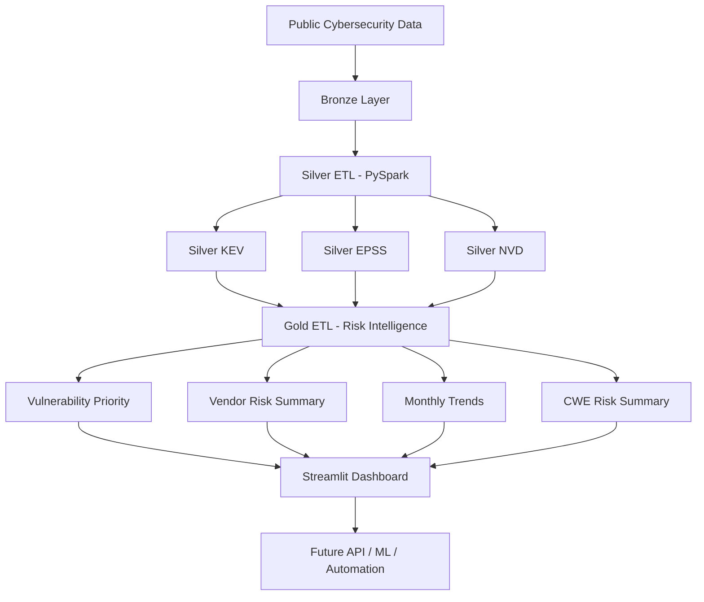
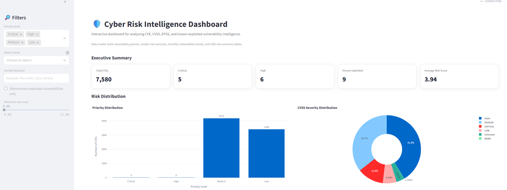
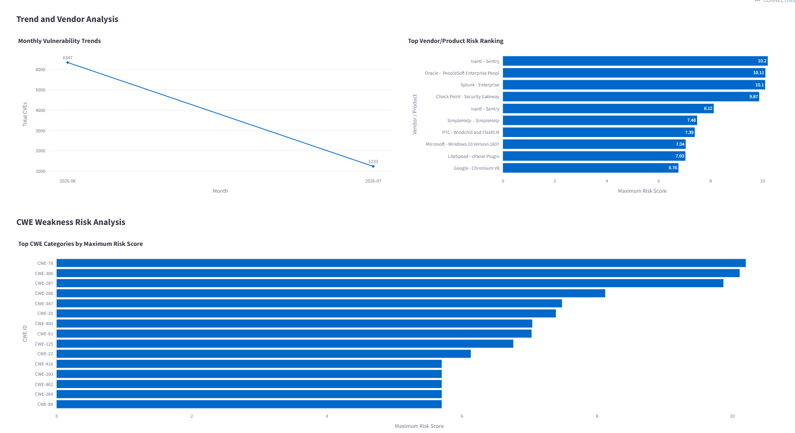
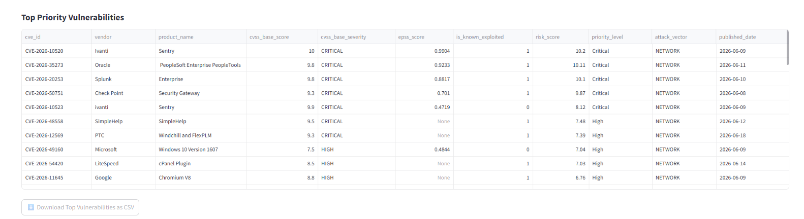

# 🛡️ Cyber Risk Intelligence Lakehouse


A PySpark-based cyber risk intelligence lakehouse for collecting, cleaning, transforming, and analysing public vulnerability intelligence data.

This project combines **CVE**, **CVSS**, **EPSS**, and **CISA Known Exploited Vulnerabilities** signals into analytics-ready Gold tables for vulnerability prioritisation, vendor risk analysis, CWE weakness summaries, monthly vulnerability trend monitoring, and an interactive Streamlit dashboard.

---

## 📌 Project Overview

Cybersecurity teams often need to prioritise thousands of vulnerabilities across many vendors and products. Raw vulnerability feeds are useful, but they are usually fragmented across different sources and are not immediately ready for analysis.

This project builds a local data lakehouse pipeline that turns raw cybersecurity data into structured, queryable, and dashboard-ready datasets.

The pipeline follows a classic **Bronze → Silver → Gold** data architecture:

```text
Bronze Layer  →  Silver Layer  →  Gold Layer  →  Dashboard
Raw data         Clean data       Analytics       Visual insights
```

---

## 🎯 Project Goals

- Ingest public cybersecurity vulnerability datasets.
- Store raw records in a local Bronze layer.
- Clean and standardise vulnerability data with PySpark.
- Build Silver tables for KEV, EPSS, and NVD data.
- Join multiple vulnerability intelligence sources.
- Create Gold tables for risk scoring and reporting.
- Build an interactive Streamlit dashboard for vulnerability exploration.
- Prepare the project for future API, automation, and machine learning extensions.

---

## 🧠 Why This Project Matters

Not all vulnerabilities should be prioritised in the same way.

A vulnerability may have a high CVSS score, but it may not be likely to be exploited. Another vulnerability may have a lower severity score, but it may already be actively exploited in the real world.

This project combines multiple risk signals:

- **CVSS**: technical severity
- **EPSS**: probability of exploitation
- **CISA KEV**: known real-world exploitation
- **NVD metadata**: vendor, product, CWE, attack vector, and publication information

By combining these signals, the project supports a more practical vulnerability prioritisation workflow.

---

## 🏗️ Lakehouse Architecture



### Architecture Summary

```text
Public Cybersecurity Sources
        |
        v
Bronze Layer
Raw KEV, EPSS, and NVD data
        |
        v
Silver Layer
Cleaned and standardised vulnerability tables
        |
        v
Gold Layer
Analytics-ready risk intelligence tables
        |
        v
Streamlit Dashboard
Interactive cyber risk exploration
```

---

## 🗂️ Data Sources

### 1. CISA Known Exploited Vulnerabilities

Used to identify vulnerabilities that are known to have been exploited in the real world.

Main information includes:

- CVE ID
- Vendor or project
- Product
- Vulnerability name
- Date added
- Due date
- Required action
- Known ransomware campaign use

---

### 2. FIRST EPSS

Used to estimate how likely a vulnerability is to be exploited.

Main information includes:

- CVE ID
- EPSS score
- EPSS percentile
- EPSS date

---

### 3. NVD CVE Data

Used to extract vulnerability metadata, CVSS scores, affected vendors/products, CWE categories, and publication dates.

Main information includes:

- CVE ID
- Published date
- Last modified date
- Vulnerability description
- CWE ID
- Affected vendor
- Affected product
- CVSS score
- CVSS severity
- CVSS vector string
- Attack vector
- Attack complexity
- User interaction
- Impact metrics

---

## 📁 Project Structure

```text
cyber-risk-intelligence-lakehouse/
│
├── app/
│   └── dashboard.py
│
├── assets/
│   ├── dashboard_overview.png
│   ├── dashboard_risk_analysis.png
│   └── dashboard_top_vulnerabilities.png
│
├── scripts/
│   ├── inspect_lakehouse.py
│   └── run_ingestion.py
│
├── src/
│   └── cyber_risk/
│       ├── __init__.py
│       ├── config.py
│       │
│       ├── ingestion/
│       │   ├── __init__.py
│       │   ├── download_epss.py
│       │   ├── download_kev.py
│       │   ├── download_nvd_recent.py
│       │   └── http_client.py
│       │
│       ├── etl/
│       │   ├── __init__.py
│       │   ├── spark_session.py
│       │   ├── build_silver_tables.py
│       │   └── build_gold_tables.py
│       │
│       └── quality/
│           └── __init__.py
│
├── .gitignore
├── pyproject.toml
├── requirements.txt
└── README.md
```

---

## 🥉 Bronze Layer

The Bronze layer stores raw downloaded cybersecurity data.

Expected local folder:

```text
data/bronze/
```

Example raw data folders:

```text
data/bronze/kev/
data/bronze/epss/
data/bronze/nvd/
```

The Bronze layer is excluded from Git because it contains generated local data files.

---

## 🥈 Silver Layer

The Silver layer contains cleaned and standardised datasets.

Generated Silver tables:

```text
data/silver/silver_kev
data/silver/silver_epss
data/silver/silver_nvd
```

Validated Silver output:

```text
Silver KEV: 1,631 rows
Silver EPSS: 5,000 rows
Silver NVD: 7,580 rows
```

### Silver KEV Table

Purpose: clean and standardise known exploited vulnerability records.

Important fields:

```text
cve_id
vendor_project
product
vulnerability_name
date_added
due_date
known_ransomware_campaign_use
required_action
short_description
notes
cwe_list
date_added_year
date_added_month
```

### Silver EPSS Table

Purpose: clean and standardise exploit probability scores.

Important fields:

```text
cve_id
epss_score
epss_percentile
epss_date
epss_year
epss_month
```

### Silver NVD Table

Purpose: clean and standardise CVE metadata, CVSS severity, CWE category, and affected products.

Important fields:

```text
cve_id
source_identifier
published_datetime
last_modified_datetime
vulnerability_status
description
cwe_id
affected_vendor
affected_product
affected_entry_count
reference_count
cvss_version
cvss_base_score
cvss_base_severity
cvss_vector_string
attack_vector
attack_complexity
privileges_required
user_interaction
confidentiality_impact
integrity_impact
availability_impact
published_date
last_modified_date
published_year
published_month
```

---

## 🥇 Gold Layer

The Gold layer contains analytics-ready cyber risk intelligence tables.

Generated Gold tables:

```text
data/gold/vulnerability_priority
data/gold/vendor_risk_summary
data/gold/monthly_vulnerability_trends
data/gold/cwe_risk_summary
```

Validated Gold output:

```text
Gold Vulnerability Priority: 7,580 rows
Gold Vendor Risk Summary: 2,738 rows
Gold Monthly Trends: 2 rows
Gold CWE Risk Summary: 331 rows
```

---

## 📊 Gold Table 1: Vulnerability Priority

This is the main analytics table.

It combines:

- NVD vulnerability metadata
- CVSS severity information
- EPSS exploitation probability
- CISA KEV known exploited status
- Vendor and product information
- Risk score
- Priority level

Important fields:

```text
cve_id
published_date
last_modified_date
vulnerability_status
description
cwe_id
vendor
product_name
cvss_version
cvss_base_score
cvss_base_severity
cvss_vector_string
attack_vector
attack_complexity
privileges_required
user_interaction
confidentiality_impact
integrity_impact
availability_impact
epss_date
epss_score
epss_percentile
is_known_exploited
known_ransomware_campaign_use
date_added
due_date
required_action
risk_score
priority_level
reference_count
affected_entry_count
published_year
published_month
```

Example use cases:

- Find the highest priority vulnerabilities.
- Identify known exploited vulnerabilities.
- Combine severity and exploit probability.
- Support patch prioritisation decisions.

---

## 🏢 Gold Table 2: Vendor Risk Summary

This table aggregates vulnerability risk by vendor and product.

Important fields:

```text
vendor
product_name
total_vulnerabilities
known_exploited_count
average_risk_score
maximum_risk_score
average_epss_score
critical_count
high_count
```

Example use cases:

- Identify vendors with high-risk products.
- Compare products by vulnerability concentration.
- Support vendor-level cyber risk reporting.

---

## 📅 Gold Table 3: Monthly Vulnerability Trends

This table summarises vulnerability activity by year and month.

Important fields:

```text
published_year
published_month
total_cve_count
known_exploited_count
average_cvss_score
average_epss_score
critical_count
high_count
network_attack_vector_count
```

Validated monthly trend output:

```text
2026-06: 6,347 CVEs
2026-07: 1,233 CVEs
```

Example use cases:

- Track vulnerability publication volume over time.
- Monitor monthly critical and high severity counts.
- Identify changes in network-based attack exposure.

---

## 🧬 Gold Table 4: CWE Risk Summary

This table aggregates vulnerability risk by CWE weakness category.

Important fields:

```text
cwe_id
total_vulnerabilities
known_exploited_count
average_risk_score
maximum_risk_score
average_cvss_score
average_epss_score
```

Example use cases:

- Identify common weakness categories.
- Compare CWE groups by risk score.
- Support secure development and remediation planning.

---

## 🧮 Risk Scoring Logic

The project uses a practical scoring approach that combines multiple vulnerability signals.

Main signals:

```text
CVSS base score
EPSS exploit probability
Known exploited status
Reference count
Affected product information
```

Conceptual logic:

```text
Risk Score = severity signal + exploitability signal + known exploitation signal + exposure context
```

The final risk score is mapped into priority levels:

```text
Critical
High
Medium
Low
```

Validated priority distribution:

```text
Critical: 5
High: 6
Medium: 4,170
Low: 3,399
```

This makes it easier to focus on vulnerabilities that are severe, likely to be exploited, or already known to be exploited.

---

## 📊 Streamlit Dashboard

This project includes an interactive Streamlit dashboard for exploring the Gold layer cyber risk intelligence tables.

The dashboard reads from:

```text
data/gold/vulnerability_priority
data/gold/vendor_risk_summary
data/gold/monthly_vulnerability_trends
data/gold/cwe_risk_summary
```

### Dashboard Features

- Executive KPI cards for total CVEs, Critical vulnerabilities, High vulnerabilities, known exploited vulnerabilities, and average risk score
- Priority distribution chart
- CVSS severity distribution chart
- Monthly vulnerability trend chart
- Top vendor and product risk ranking
- CWE weakness risk analysis
- Top priority vulnerability explorer
- Sidebar filters for priority level, attack vector, vendor keyword, known exploited status, and minimum risk score
- CSV download for top priority vulnerabilities

### Dashboard Preview

```text
Executive Summary
Total CVEs: 7,580
Critical: 5
High: 6
Known Exploited: 9
Average Risk Score: 3.94
```

### Dashboard Screenshots

#### Executive Overview



#### Risk, Trend, Vendor, and CWE Analysis



#### Top Priority Vulnerabilities



### Run the Dashboard

After building the Gold tables, run:

```powershell
python -m streamlit run app\dashboard.py
```

The dashboard opens locally at:

```text
http://localhost:8501
```

---

## ✅ Validated Pipeline Output

The lakehouse pipeline has been validated locally.

### Silver Tables

```text
Silver KEV
Rows: 1,631
Columns: 13

Silver EPSS
Rows: 5,000
Columns: 6

Silver NVD
Rows: 7,580
Columns: 26
```

### Gold Tables

```text
Gold Vulnerability Priority
Rows: 7,580
Columns: 33

Gold Vendor Risk Summary
Rows: 2,738
Columns: 9

Gold Monthly Trends
Rows: 2
Columns: 9

Gold CWE Risk Summary
Rows: 331
Columns: 7
```

---

## ⚙️ Tech Stack

| Category | Tools |
|---|---|
| Language | Python |
| Data Processing | PySpark |
| Dashboard | Streamlit, Plotly |
| Storage Format | Parquet |
| Architecture | Bronze, Silver, Gold Lakehouse |
| Data Sources | CISA KEV, FIRST EPSS, NVD CVE data |
| Development | Git, GitHub, Virtual Environment |
| Planned API | FastAPI |
| Planned ML | scikit-learn, XGBoost, SHAP, MLflow |

---

## 🚀 How to Run Locally

### 1. Clone the repository

```bash
git clone https://github.com/momo840505/cyber-risk-intelligence-lakehouse.git
cd cyber-risk-intelligence-lakehouse
```

### 2. Create a virtual environment

```bash
python -m venv .venv
```

### 3. Activate the virtual environment

Windows PowerShell:

```powershell
Set-ExecutionPolicy -Scope Process -ExecutionPolicy Bypass
.\.venv\Scripts\Activate.ps1
```

### 4. Install dependencies

```powershell
python -m pip install --upgrade pip
python -m pip install -r requirements.txt
python -m pip install -e .
```

### 5. Configure Hadoop winutils on Windows

PySpark on Windows may require `winutils.exe`.

Example setup:

```powershell
$env:HADOOP_HOME = "C:\hadoop"
$env:Path = "C:\hadoop\bin;$env:Path"
where.exe winutils
```

Expected output:

```text
C:\hadoop\bin\winutils.exe
```

### 6. Run data ingestion

```powershell
python .\scripts\run_ingestion.py
```

### 7. Build Silver tables

```powershell
python -m cyber_risk.etl.build_silver_tables
```

### 8. Build Gold tables

```powershell
python -m cyber_risk.etl.build_gold_tables
```

### 9. Inspect lakehouse outputs

```powershell
python .\scripts\inspect_lakehouse.py
```

### 10. Run the dashboard

```powershell
python -m streamlit run app\dashboard.py
```

---

## 🧪 Example Commands Used During Validation

```powershell
python -m cyber_risk.etl.build_silver_tables
python -m cyber_risk.etl.build_gold_tables
python .\scripts\inspect_lakehouse.py
python -m streamlit run app\dashboard.py
```

Expected folders after successful execution:

```text
data/silver/silver_kev
data/silver/silver_epss
data/silver/silver_nvd

data/gold/vulnerability_priority
data/gold/vendor_risk_summary
data/gold/monthly_vulnerability_trends
data/gold/cwe_risk_summary
```

---

## 📈 Example Insights

Based on the generated Gold tables:

- The lakehouse contains 7,580 cleaned vulnerability records.
- Most vulnerabilities are classified as Medium or Low priority.
- A small number of vulnerabilities are classified as Critical or High priority.
- Known exploited vulnerabilities can be separated from general CVE records.
- Vendor-level aggregation helps identify products with concentrated cyber risk.
- CWE summaries help identify common weakness categories.
- Monthly trends show vulnerability publication patterns over time.

---

## 🧭 Current Project Status

Completed:

- Project structure
- Data ingestion modules
- PySpark session setup
- Silver ETL
- Gold ETL
- Lakehouse inspection script
- Streamlit dashboard
- Dashboard screenshots in README
- GitHub repository setup
- Professional README documentation

Planned:

- Data quality checks
- Machine learning risk classifier
- FastAPI query service
- Automated scheduled ingestion

---

## 🔮 Future Improvements

### Data Quality

Add validation checks for:

- Missing CVE IDs
- Duplicate CVE records
- Invalid CVSS score ranges
- Invalid EPSS score ranges
- Null critical fields
- Unexpected schema changes

### Machine Learning

Add a model to classify vulnerability priority using:

- CVSS metrics
- EPSS score
- Attack vector
- Attack complexity
- Vendor/product information
- Known exploitation status

### API Layer

Add FastAPI endpoints such as:

```text
/api/vulnerabilities/top
/api/vendors/risk-summary
/api/cwe/risk-summary
/api/trends/monthly
```

### Automation

Add scheduled ingestion to keep vulnerability intelligence up to date.

---

## 👤 Author

**Mo Mo**  
Master of Data Science Student  
GitHub: [@momo840505](https://github.com/momo840505)

---

## 📌 Repository

```text
https://github.com/momo840505/cyber-risk-intelligence-lakehouse
```
