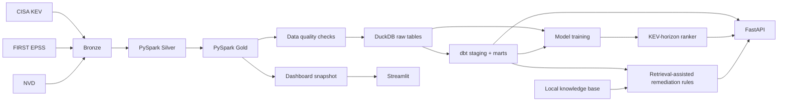

# Cyber Risk Intelligence Lakehouse

[](https://cyber-risk-intelligence-momo.streamlit.app)
[](https://github.com/momo840505/cyber-risk-intelligence-lakehouse/actions/workflows/python-ci.yml)
[](https://github.com/momo840505/cyber-risk-intelligence-lakehouse/actions/workflows/docker-build.yml)
[](https://github.com/momo840505/cyber-risk-intelligence-lakehouse/actions/workflows/terraform-validate.yml)

I built this project to practice a data-engineering pipeline on data that changes regularly and has a real prioritisation problem behind it.

The repo pulls public vulnerability data from CISA KEV, FIRST EPSS, and NVD, processes it through PySpark Bronze/Silver/Gold layers, builds analytics tables with DuckDB and dbt, trains a small ranking model, and exposes the results through FastAPI and Streamlit.

I have tried to keep the claims in this README close to what the code actually does. The AWS files are a validated Terraform deployment template; I have not applied that infrastructure, so I do not describe it as a live AWS deployment.

## Data flow


```mermaid
flowchart LR
    A[CISA KEV] --> D[Bronze]
    B[FIRST EPSS] --> D
    C[NVD] --> D

    D --> E[PySpark Silver]
    E --> F[PySpark Gold]
    F --> G[Data quality checks]
    G --> H[DuckDB raw tables]

    H --> I[dbt staging + marts]
    H --> J[Model training]
    I --> J
    J --> K[KEV-horizon ranker]

    I --> L[Retrieval-assisted remediation rules]
    Q[Local knowledge base] --> L

    I --> M[FastAPI]
    K --> M
    L --> M

    F --> N[Dashboard snapshot]
    N --> O[Streamlit]
```

## What the model is actually predicting

The model is not trained to predict "will this vulnerability be exploited?"

The retrospective target is narrower:

> Among mature CVEs, rank which ones receive a **CISA KEV designation within 180 days of NVD publication**.

I use a chronological train/validation/test split. Validation is used for threshold diagnostics, and the final test period is kept separate until evaluation.

The model intentionally excludes:

- `is_known_exploited`
- `risk_score`
- `priority_level`
- EPSS

from the input features used by the classifier.

The API returns an **uncalibrated ranking score**, not an exploitation probability.

Current temporal test results:

```text
ROC-AUC:            0.8666
Average precision:  0.0405
Positive rate:      0.003443
Precision@20:       0.1500
Recall@20:          0.0385
Lift@20:            43.56x
```

The target is very rare, so I care more about ranking metrics than headline accuracy. The tuned binary threshold is not the main result because recall on the temporal test set is low.

There is another limitation that matters here: this is a retrospective benchmark built from the current NVD snapshot. Some NVD fields can be edited after publication, so this is not a perfect point-in-time historical simulation.

## Remediation guidance

`rag/remediation_engine.py` is a retrieval-assisted rule engine.

It uses TF-IDF to retrieve relevant text from a small local knowledge base, then combines those retrieved actions with CVE-specific rules such as urgency, attack vector, and CWE handling.

There is no generative model in this remediation step. The returned actions come from explicit rules and retrieved source text.

I kept it this way so the remediation output is easy to trace back to the code and source material.

## Main data layers

### Ingestion

- CISA Known Exploited Vulnerabilities
- FIRST EPSS daily bulk data
- NVD CVE data

### PySpark

- Bronze source storage
- Silver cleaned records
- Gold vulnerability and summary tables

### Analytics

- DuckDB
- dbt staging models
- dbt marts for vulnerability, vendor, CWE, and monthly views

### Quality checks

The Gold validation checks include:

- required columns;
- missing or duplicate CVE IDs;
- CVSS, EPSS, and risk-score ranges;
- valid priority values;
- known-exploited flag values;
- non-empty aggregate outputs;
- valid month ranges.

The generated report is stored in `reports/data_quality_report.csv`.

## API

Run locally at:

```text
http://127.0.0.1:8001
```

Main routes:

```text
GET  /livez
GET  /readyz
GET  /health
GET  /metrics
GET  /vulnerabilities/top
GET  /vulnerabilities/{cve_id}
GET  /vendors/risk-summary
GET  /cwe/risk-summary
GET  /trends/monthly
POST /score-kev-horizon
GET  /remediation/{cve_id}
```

`/livez` only checks that the service process is running.

`/readyz` checks whether the DuckDB database can be queried and whether the model artifact can be loaded. It returns HTTP 503 until both are usable.

## Monitoring

The API writes a small CSV usage log with route, status code, response time, and client host, then exposes summary values through `/metrics`.

This is enough for a portfolio demo, but it is not the same as a proper centralised monitoring stack.

## Local setup

```powershell
git clone https://github.com/momo840505/cyber-risk-intelligence-lakehouse.git
cd cyber-risk-intelligence-lakehouse
python -m venv .venv
.\.venv\Scripts\Activate.ps1
python -m pip install --upgrade pip
python -m pip install -r requirements.txt
python -m pip install -e .
```

PySpark on Windows may also need Java and a local Hadoop `winutils.exe` setup.

Run the pipeline:

```powershell
python .\scripts\run_pipeline.py
```

Train the model:

```powershell
python .\scripts\run_ml.py
```

Prepare the dashboard data:

```powershell
python .\scripts\prepare_dashboard_data.py
```

Run the dashboard:

```powershell
python -m streamlit run app\dashboard.py
```

Run the API:

```powershell
python .\scripts\run_api.py
```

## Docker

```powershell
docker compose build
docker compose up -d
python .\scripts\smoke_test_api.py
```

The Docker CI job checks both sides of readiness behaviour:

- `/livez` should work when the process is running;
- `/readyz` should return 503 when the required runtime artifacts are missing.

That avoids treating a running Uvicorn process as a ready application.

## AWS Terraform

`infrastructure/aws/` contains Terraform for:

- VPC networking
- ALB
- ECS Fargate
- ECR
- S3
- IAM
- CloudWatch

The container image and runtime model/database artifacts are kept separate. The proposed ECS task downloads configured artifacts from S3 at startup.

The Terraform is formatted, initialised without a backend, and validated in CI. I have not applied it to create a live AWS environment.

See [infrastructure/aws/README.md](infrastructure/aws/README.md) for the deployment design.

## Tests and CI

GitHub Actions currently runs:

- Python compilation and pytest;
- Docker build plus startup/liveness checks;
- Terraform format/init/validate.

The Python tests cover the API and remediation logic. ETL fixture coverage is still thinner than I would like, so that is one of the next areas I would work on.

## Current limitations

- EPSS uses the current daily bulk file; the pipeline does not reconstruct the historical EPSS value that was available on every CVE publication date.
- The NVD side is still a retrospective current-snapshot benchmark rather than a point-in-time archive.
- The remediation knowledge base is small.
- Most transformation logic is still in PySpark; dbt currently sits on top of already-aggregated Gold data.
- ETL integration fixtures are limited.
- The Streamlit deployment reads a committed Gold snapshot instead of rebuilding the Spark pipeline online.
- The AWS infrastructure is designed and validated but not deployed.
- There is no scheduled orchestration/backfill system yet.

## What I would add next

1. Point-in-time EPSS history.
2. Scheduled orchestration with retry, freshness checks, and backfill handling.
3. More business logic moved into dbt.
4. Better ETL/API integration fixtures.
5. Versioned artifact publishing for the model and DuckDB database.
6. A real AWS deployment workflow if I decide to run the infrastructure.

## Repository layout

```text
api/                 FastAPI service
app/                 Streamlit dashboard and committed snapshot
dbt/                 dbt project
infrastructure/aws/  Terraform
ml/                  model training
rag/                 retrieval-assisted remediation rules
reports/             generated evaluation reports
scripts/             pipeline and utility commands
src/cyber_risk/      ingestion, PySpark ETL, quality checks
tests/               automated tests
```

MIT License. Copyright 2026 Wei-Ting Mo.
