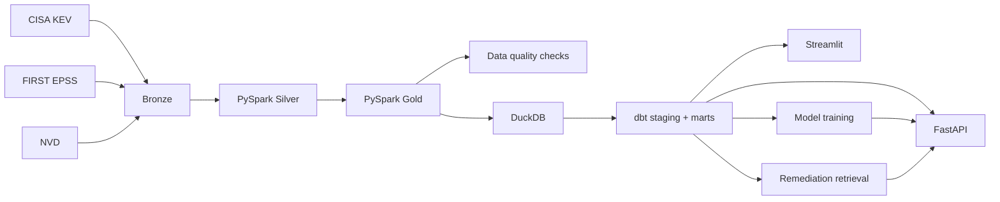

# Cyber Risk Intelligence Lakehouse

[](https://cyber-risk-intelligence-momo.streamlit.app)
[](https://github.com/momo840505/cyber-risk-intelligence-lakehouse/actions/workflows/python-ci.yml)
[](https://github.com/momo840505/cyber-risk-intelligence-lakehouse/actions/workflows/docker-build.yml)
[](https://github.com/momo840505/cyber-risk-intelligence-lakehouse/actions/workflows/terraform-validate.yml)

A cyber-risk data project built around public CISA, FIRST EPSS, and NVD data. The repository covers ingestion, PySpark transformations, dbt marts, data-quality checks, a small KEV-horizon triage ranking model, a FastAPI service, a Streamlit dashboard, retrieval-assisted remediation guidance, Docker, and an AWS Terraform deployment template.

The project is deliberately explicit about what is local, what is tested in CI, and what has not been deployed to AWS.

## Architecture


```mermaid
flowchart LR
    A[CISA KEV] --> D[Bronze]
    B[FIRST EPSS] --> D
    C[NVD] --> D
    D --> E[PySpark Silver]
    E --> F[PySpark Gold]
    F --> G[Data quality checks]
    F --> H[DuckDB]
    H --> I[dbt staging + marts]
    I --> J[FastAPI]
    I --> K[Streamlit]
    I --> L[Model training]
    I --> M[Remediation retrieval]
    L --> J
    M --> J
```

For AWS, the container and runtime artifacts are separated: the image is stored in ECR, the DuckDB/model/metrics files are stored in S3, and ECS downloads the configured artifact versions at task startup. The ALB only marks a task ready after the database can be queried and the model can be loaded.

## Main components

### Data pipeline

- CISA KEV ingestion
- FIRST EPSS daily bulk ingestion
- NVD CVE ingestion with segmented historical lookback
- PySpark Bronze/Silver/Gold layers
- Gold-layer validation
- DuckDB analytics database
- dbt staging and marts

### Analytics outputs

- vulnerability priority
- vendor/product risk summary
- monthly vulnerability summary
- CWE risk summary
- Streamlit dashboard

### Model

The model ranks mature CVEs by whether they receive a CISA KEV designation within 180 days of NVD publication. It intentionally excludes `is_known_exploited`, `risk_score`, `priority_level`, and EPSS from the input features.

Evaluation uses a retrospective chronological train/validation/test split. Validation is used for threshold diagnostics; the final test period remains untouched until evaluation. Because the target is extremely rare, ranking metrics are the primary result and the API exposes an uncalibrated triage score rather than calling the output an exploitation probability.

Current temporal test highlights:

```text
ROC-AUC:           0.8666
Average precision: 0.0405
Positive rate:     0.003443
Precision@20:      0.1500
Recall@20:         0.0385
Lift@20:           43.56x
```

The tuned binary threshold is not presented as the main outcome because recall on the temporal test set is low. The useful signal is the model's ability to concentrate rare KEV-within-180-day cases near the top of the ranking.

This is a retrospective benchmark built from the current NVD snapshot, not a point-in-time historical backtest. NVD fields such as references and CVSS metadata can be revised after initial publication, so the model should be treated as a portfolio triage experiment rather than a production forecasting claim.

### Remediation guidance

`rag/remediation_engine.py` is a retrieval-assisted rule engine. It uses TF-IDF retrieval over a small local knowledge base and combines relevant retrieved actions with CVE-specific rules. The implementation is deterministic: retrieved source material and explicit rules determine the returned actions.

### API

Local URL:

```text
http://127.0.0.1:8001
```

Important endpoints:

```text
GET  /livez
GET  /readyz
GET  /metrics
GET  /vulnerabilities/top
GET  /vulnerabilities/{cve_id}
GET  /vendors/risk-summary
GET  /cwe/risk-summary
GET  /trends/monthly
POST /score-kev-horizon
GET  /remediation/{cve_id}
```

`/livez` checks that the service process is running. `/readyz` checks the database and model and returns HTTP 503 until both are usable.

## Local setup

```powershell
git clone https://github.com/momo840505/cyber-risk-intelligence-lakehouse.git
cd cyber-risk-intelligence-lakehouse
python -m venv .venv
.\.venv\Scripts\Activate.ps1
python -m pip install --upgrade pip
python -m pip install -r requirements.txt
python -m pip install -e .
```

PySpark on Windows may also require Java and a local Hadoop `winutils.exe` setup.

Run the data pipeline:

```powershell
python .\scripts\run_pipeline.py
```

Train the model:

```powershell
python .\scripts\run_ml.py
```

Prepare the dashboard snapshot:

```powershell
python .\scripts\prepare_dashboard_data.py
```

Run the dashboard:

```powershell
python -m streamlit run app\dashboard.py
```

Run the API:

```powershell
python .\scripts\run_api.py
```

## Docker

Docker Compose mounts the locally built DuckDB database and model artifacts:

```powershell
docker compose build
docker compose up -d
python .\scripts\smoke_test_api.py
```

The image-only CI job checks `/livez` and also confirms that `/readyz` correctly returns 503 when runtime artifacts are absent. This avoids treating a running Uvicorn process as a ready application.

## AWS Terraform

The Terraform template covers VPC networking, ALB, ECS Fargate, ECR, S3, IAM and CloudWatch. The API image is separate from the runtime database/model artifacts; ECS retrieves the configured artifact keys from S3 at startup.

See [`infrastructure/aws/README.md`](infrastructure/aws/README.md) for the deployment flow and remaining production work.

## Tests and CI

GitHub Actions runs:

- Python compile and pytest checks
- Docker image build and liveness test
- Terraform format/init/validate

The test suite covers remediation rules/retrieval and API liveness/readiness behaviour. ETL fixture coverage is still an area for further work.

## Data quality

Gold-layer checks cover:

- required columns
- CVE nulls and duplicates
- CVSS/EPSS/risk ranges
- accepted priority values
- known-exploited flag values
- non-empty aggregate tables
- month range checks

The generated report is stored in `reports/data_quality_report.csv`.

## Known limitations

- The pipeline uses the current daily EPSS bulk file; it does not yet reconstruct historical EPSS values at each CVE publication date.
- The remediation knowledge base is intentionally small.
- dbt currently sits on top of already-aggregated Gold data, so most transformation logic is still in PySpark.
- The AWS configuration is validated in CI but should not be described as deployed unless the resources have actually been applied.
- The current Streamlit deployment reads a committed Gold snapshot rather than rebuilding the Spark pipeline in the hosted environment.

## Next engineering steps

1. Point-in-time EPSS history for retrospective analyses.
2. Scheduled orchestration with retry/backfill/freshness handling.
3. More dbt-owned dimensional and business logic.
4. ETL/API integration fixtures and broader test coverage.
5. Versioned artifact publishing and an AWS deployment workflow.

## Repository layout

```text
api/                 FastAPI service
app/                 Streamlit dashboard and committed snapshot
dbt/                 dbt project
infrastructure/aws/  Terraform
ml/                  model training
rag/                 remediation retrieval and knowledge base
reports/             generated evaluation reports
scripts/             pipeline and utility commands
src/cyber_risk/      ingestion, PySpark ETL, quality checks
tests/               automated tests
```

MIT License. Copyright 2026 Wei-Ting Mo.
