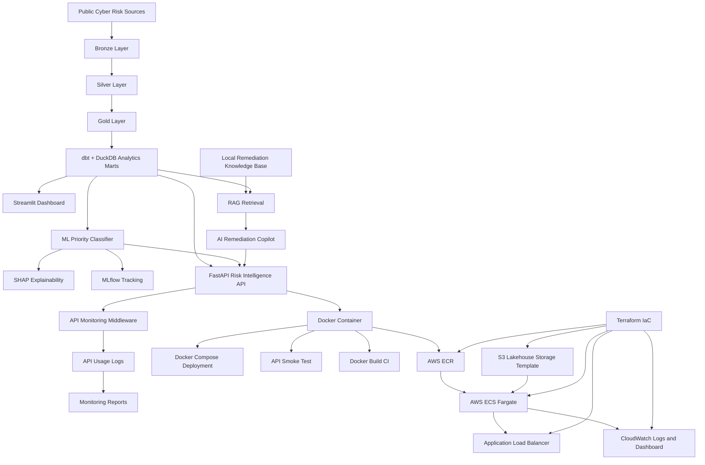
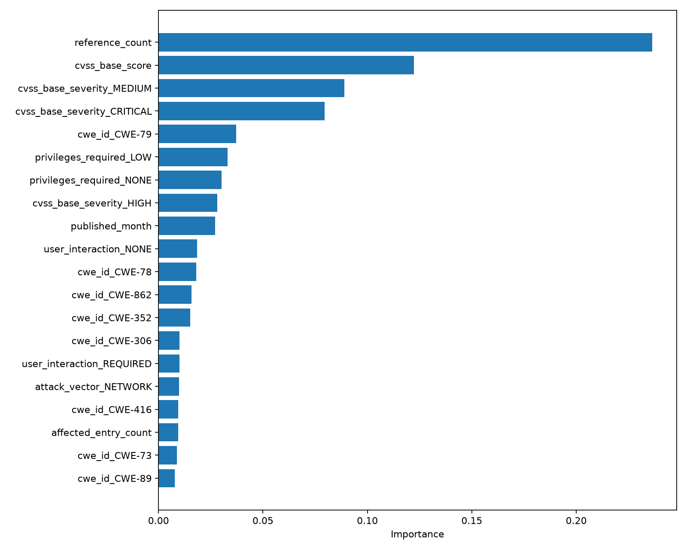
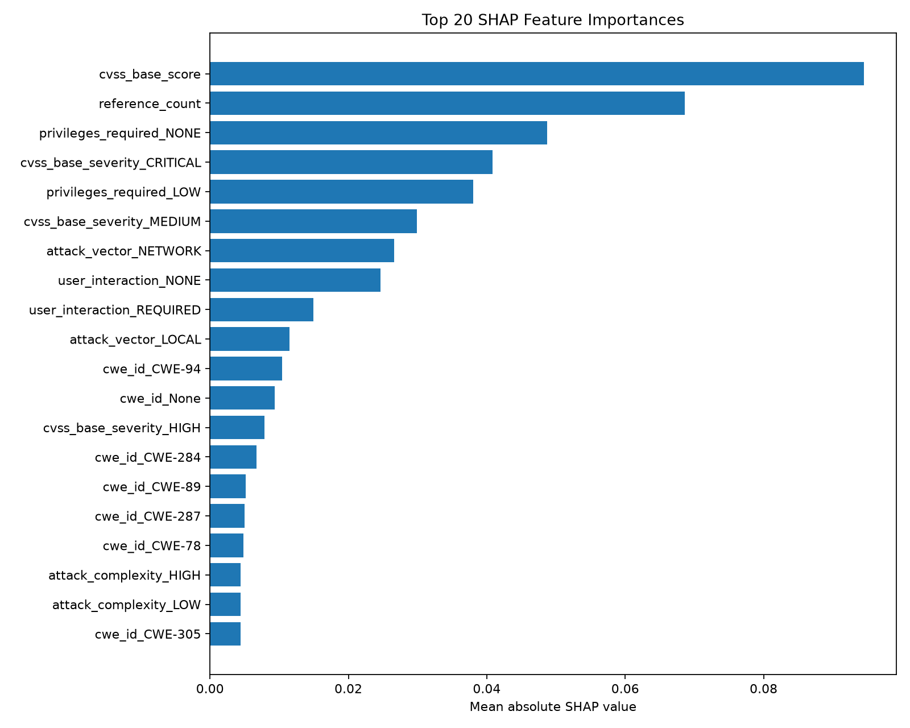
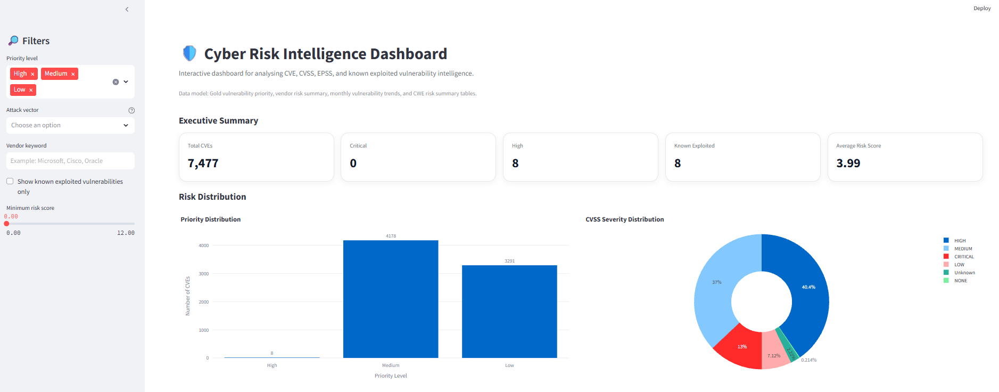
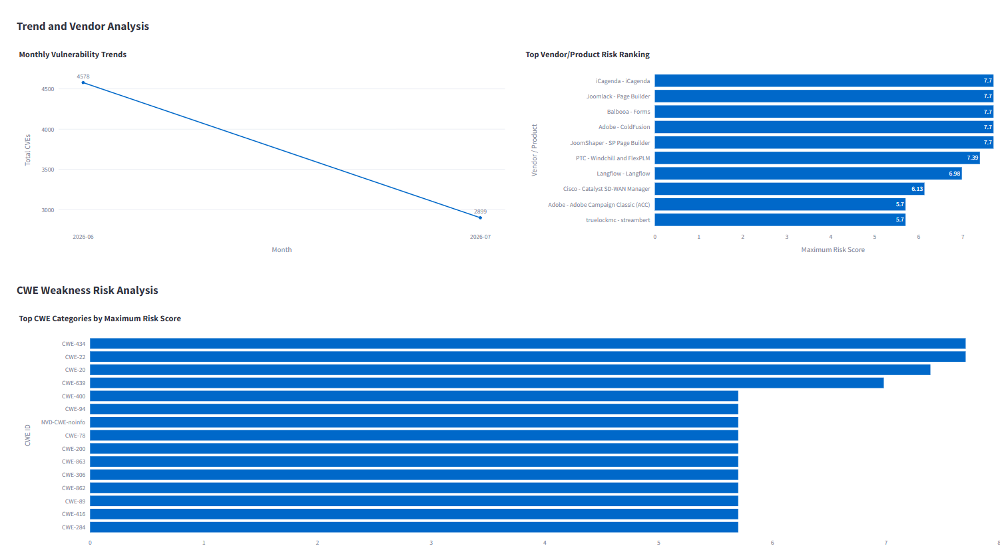
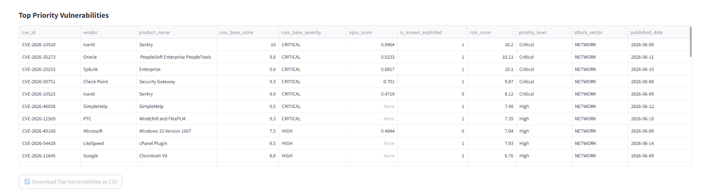

# Cyber Risk Intelligence Lakehouse + AI Remediation Copilot

[](https://cyber-risk-intelligence-momo.streamlit.app)
[](https://github.com/momo840505/cyber-risk-intelligence-lakehouse/actions/workflows/python-ci.yml)
[](https://github.com/momo840505/cyber-risk-intelligence-lakehouse/actions)
[](https://github.com/momo840505/cyber-risk-intelligence-lakehouse/actions)


## Overview

This project is an end-to-end **Cyber Risk Intelligence Platform** that combines data engineering, analytics engineering, machine learning, API development, RAG-based remediation guidance, monitoring, Docker deployment readiness, and AWS infrastructure-as-code design.

It ingests public cyber risk data, builds a PySpark lakehouse, transforms analytics marts with dbt and DuckDB, trains a vulnerability priority classifier, explains model behaviour with SHAP, exposes risk intelligence through FastAPI, generates defensive remediation plans using local RAG retrieval, tracks API usage through monitoring logs, provides Docker deployment support, and includes a Terraform AWS architecture template.

The project is designed as a portfolio-ready platform for roles such as:

- Data Engineer
- Analytics Engineer
- Data Scientist
- Machine Learning Engineer
- AI Engineer
- Cloud Data Engineer
- Security Data Analyst

---

## Current Status

```text
✅ Phase 1: PySpark Cyber Risk Lakehouse
✅ Phase 2: dbt + DuckDB Analytics Layer
✅ Phase 3: ML Priority Classifier + SHAP + MLflow
✅ Phase 4: FastAPI Risk Intelligence API
✅ Phase 5: RAG Remediation Copilot
✅ Phase 6: API Monitoring and Observability
✅ Phase 7: Docker Deployment Readiness
✅ Phase 8: Terraform + AWS Architecture Template
```

---

## Architecture


```mermaid
flowchart TD
    A[Public Cyber Risk Sources] --> B[Bronze Layer]
    B --> C[Silver Layer]
    C --> D[Gold Layer]

    D --> E[dbt + DuckDB Analytics Marts]
    E --> F[Streamlit Dashboard]
    E --> G[ML Priority Classifier]
    G --> H[SHAP Explainability]
    G --> I[MLflow Tracking]

    E --> J[FastAPI Risk Intelligence API]
    G --> J

    K[Local Remediation Knowledge Base] --> L[RAG Retrieval]
    E --> L
    L --> M[AI Remediation Copilot]
    M --> J

    J --> N[API Monitoring Middleware]
    N --> O[API Usage Logs]
    O --> P[Monitoring Reports]

    J --> Q[Docker Container]
    Q --> R[Docker Compose Deployment]
    Q --> S[API Smoke Test]
    Q --> T[Docker Build CI]

    Q --> U[AWS ECR]
    U --> V[AWS ECS Fargate]
    V --> W[Application Load Balancer]
    V --> X[CloudWatch Logs and Dashboard]
    Y[S3 Lakehouse Storage Template] --> V
    Z[Terraform IaC] --> U
    Z --> V
    Z --> W
    Z --> X
    Z --> Y
```

---

## Data Sources

The platform uses public cyber risk intelligence sources:

- **CISA Known Exploited Vulnerabilities (KEV)**  
  Used to identify vulnerabilities with evidence of active exploitation.

- **EPSS vulnerability scoring data**  
  Used to enrich vulnerabilities with exploit probability signals when available.

- **NVD CVE data**  
  Used for CVE metadata, CVSS severity, CWE information, affected vendor/product information, and vulnerability descriptions.

---

## Project Structure

```text
cyber-risk-intelligence-lakehouse/
├── api/
│   └── main.py
│
├── app/
│   └── dashboard.py
│
├── assets/
│   ├── dashboard_overview.png
│   ├── dashboard_risk_analysis.png
│   └── dashboard_top_vulnerabilities.png
│
├── data/
│   ├── bronze/
│   ├── silver/
│   └── gold/
│
├── dbt/
│   └── cyber_risk_dbt/
│       ├── dbt_project.yml
│       └── models/
│           ├── staging/
│           └── marts/
│
├── infrastructure/
│   └── aws/
│       ├── README.md
│       ├── versions.tf
│       ├── variables.tf
│       ├── main.tf
│       ├── networking.tf
│       ├── security_groups.tf
│       ├── storage.tf
│       ├── ecr.tf
│       ├── iam.tf
│       ├── ecs.tf
│       ├── monitoring.tf
│       ├── outputs.tf
│       └── terraform.tfvars.example
│
├── ml/
│   └── train_priority_model.py
│
├── models/
│   └── exploitation_likelihood_classifier.joblib
│
├── monitoring/
│   └── api_usage_log.csv
│
├── rag/
│   ├── remediation_copilot.py
│   └── knowledge_base/
│       ├── cisa_kev_remediation.md
│       ├── cvss_prioritisation.md
│       ├── cwe_remediation.md
│       ├── emergency_response.md
│       └── vulnerability_management.md
│
├── reports/
│   ├── data_quality_report.csv
│   ├── model_metrics.json
│   ├── classification_report.csv
│   ├── confusion_matrix.csv
│   ├── feature_importance.csv
│   ├── feature_importance.png
│   ├── shap_feature_importance.png
│   ├── copilot_eval_report.csv
│   ├── copilot_eval_summary.json
│   ├── api_endpoint_summary.csv
│   └── api_monitoring_summary.json
│
├── scripts/
│   ├── run_pipeline.py
│   ├── run_ingestion.py
│   ├── validate_lakehouse.py
│   ├── inspect_lakehouse.py
│   ├── build_analytics_database.py
│   ├── run_dbt.py
│   ├── run_ml.py
│   ├── run_api.py
│   ├── run_copilot.py
│   ├── evaluate_copilot.py
│   ├── generate_monitoring_report.py
│   ├── smoke_test_api.py
│   └── validate_terraform_template.py
│
├── .github/
│   └── workflows/
│       ├── ci.yml
│       ├── docker-build.yml
│       └── terraform-validate.yml
│
├── Dockerfile
├── docker-compose.yml
├── requirements.txt
├── requirements-api.txt
├── .dockerignore
├── .gitignore
└── README.md
```

---

## Lakehouse Layers

### Bronze Layer

The Bronze layer stores raw ingested cyber risk data from public sources.

Typical inputs:

- CISA KEV records
- EPSS vulnerability scoring data
- NVD CVE records

### Silver Layer

The Silver layer cleans, normalises, and prepares records for analytics.

Typical transformations:

- Standardised CVE IDs
- Normalised CVSS fields
- Parsed CWE IDs
- Vendor and product extraction
- Known exploited vulnerability flags
- Reference and affected product counts

### Gold Layer

The Gold layer produces analytics-ready datasets.

Gold outputs include:

- `vulnerability_priority`
- `vendor_risk_summary`
- `monthly_vulnerability_trends`
- `cwe_risk_summary`

---

## Data Quality Validation

The project includes automated validation for the Gold lakehouse outputs.

Validation checks include:

- Required columns exist
- CVE IDs are not missing
- CVE IDs are unique where expected
- CVSS scores are within valid range
- EPSS scores are within valid range when available
- Risk scores are within expected bounds
- Priority levels are valid
- Known exploited flags are binary
- Vendor risk summary tables contain required fields

Run validation:

```powershell
python .\scripts\validate_lakehouse.py
```

Example result:

```text
PASS: 18
WARN: 0
FAIL: 0
Data quality validation completed successfully.
```

---

## dbt Analytics Layer

The dbt layer builds staging and mart models on top of a DuckDB analytics database.

### dbt Models

Staging models:

- `stg_vulnerability_priority`
- `stg_vendor_risk_summary`
- `stg_monthly_vulnerability_trends`
- `stg_cwe_risk_summary`

Mart models:

- `mart_vulnerability_priority`
- `mart_vendor_risk_summary`
- `mart_monthly_vulnerability_trends`
- `mart_cwe_risk_summary`

Run dbt:

```powershell
python .\scripts\run_dbt.py
```

Example dbt result:

```text
Done. PASS=26 WARN=0 ERROR=0 SKIP=0 NO-OP=0 TOTAL=26
```

Serve dbt docs:

```powershell
cd dbt\cyber_risk_dbt
dbt docs generate
dbt docs serve
```

---

## Machine Learning: Exploitation-Likelihood Classifier

The ML component trains a classifier that predicts whether a CVE is likely
to become a **CISA Known Exploited Vulnerability (KEV)** entry, using only
metadata available at CVE publication time.

### A design note on target leakage (and why the target changed)

An earlier version of this model predicted `priority_level`, a label
computed in the ETL layer as a fixed linear combination of CVSS score,
EPSS percentile, and a handful of CVSS vector fields, thresholded into
four bands (see `src/cyber_risk/etl/build_gold_tables.py`). Those exact
same fields were also being used as the model's training features. That
meant the "classifier" wasn't learning anything from the data -- it was
using 300 decision trees to re-derive a formula it already had every
input to compute directly, which is why accuracy came out around **98.6%**
(reported below, kept here deliberately as a worked example of the
problem, not a result to be proud of).

The fix: predict `is_known_exploited` instead. Unlike `priority_level`,
KEV membership is a genuinely independent, forward-looking label --
CISA adds a CVE to the list only after real-world exploitation is
observed, which has nothing to do with how the CVSS/EPSS fields were
combined in this project's own ETL code. `epss_score` / `epss_percentile`
are also excluded from the features: EPSS is itself a model for the same
question, so using its output as an input feature would just be
re-packaging someone else's prediction rather than a genuine independent
signal.

### Target

```text
is_known_exploited: 0 (not in KEV)  |  1 (in KEV)
```

### Features

Deliberately limited to information available at CVE publication time,
before anyone knows whether the vulnerability will be exploited:

- `cvss_base_score`
- `cvss_base_severity`
- `attack_vector`
- `attack_complexity`
- `privileges_required`
- `user_interaction`
- `cwe_id`
- `reference_count`
- `affected_entry_count`
- `published_month`

`risk_score`, `priority_level`, `epss_score`, and `epss_percentile` are
intentionally **not** used as features -- see the note above.

### Current Model Metrics

KEV membership is rare (most CVEs are never observed being exploited), so
this is reported as an imbalanced binary classification problem. Accuracy
alone is close to meaningless here -- a model that always predicts "not
exploited" already scores close to the baseline below without learning
anything, which is why ROC-AUC and average precision are the headline
numbers, not accuracy.

```json
{
  "positive_rate_test": "<run scripts/run_ml.py to fill in>",
  "baseline_accuracy_always_majority_class": "<run scripts/run_ml.py to fill in>",
  "roc_auc": "<run scripts/run_ml.py to fill in>",
  "average_precision": "<run scripts/run_ml.py to fill in>",
  "accuracy": "<run scripts/run_ml.py to fill in>",
  "balanced_accuracy": "<run scripts/run_ml.py to fill in>"
}
```

Run the ML workflow and copy the real numbers from
`reports/model_metrics.json` into the block above:

```powershell
python .\scripts\run_ml.py
```

---

## MLflow Tracking

The ML workflow logs experiment metadata with MLflow.

Tracked outputs include:

- Model metrics
- Classifier configuration
- Model artifact
- Feature importance
- SHAP explainability outputs

MLflow artifacts are stored locally and excluded from Git where appropriate.

---

## Model Explainability with SHAP

The project includes two explainability outputs:

```text
reports/feature_importance.png
reports/shap_feature_importance.png
```

### Feature Importance



The feature importance plot shows which input variables the classifier uses most often to split and classify vulnerabilities.

### SHAP Feature Importance



The SHAP plot explains which features have the strongest average impact on model predictions.

Important features include:

- CVSS base score
- Known exploited status
- CVSS severity
- CWE category
- Reference count
- User interaction
- Attack vector

---

## FastAPI Risk Intelligence API

The project exposes cyber risk intelligence through FastAPI.

### Local API URL

```text
http://127.0.0.1:8001
```

### Swagger UI

```text
http://127.0.0.1:8001/docs
```

### Metrics Endpoint

```text
http://127.0.0.1:8001/metrics
```

Start the API locally:

```powershell
python .\scripts\run_api.py
```

The script starts FastAPI on port `8001` by default.

---

## API Endpoints

| Method | Endpoint | Description |
|---|---|---|
| GET | `/` | Service metadata |
| GET | `/health` | Health check for analytics DB, model, and monitoring log |
| GET | `/metrics` | API usage and response time metrics |
| GET | `/vulnerabilities/top` | Top vulnerabilities ranked by risk |
| GET | `/vulnerabilities/{cve_id}` | CVE-level detail lookup |
| GET | `/vendors/risk-summary` | Vendor and product risk summary |
| GET | `/cwe/risk-summary` | CWE-level risk summary |
| GET | `/trends/monthly` | Monthly vulnerability trend summary |
| POST | `/predict-exploitation-likelihood` | Predicts KEV-exploitation likelihood from static CVE metadata |
| GET | `/remediation/{cve_id}` | RAG-based remediation plan |

---

## Example API Usage

### Health Check

```powershell
Invoke-RestMethod http://127.0.0.1:8001/health | ConvertTo-Json -Depth 5
```

Example response:

```json
{
  "status": "ok",
  "analytics_database_exists": true,
  "model_exists": true,
  "monitoring_log_exists": true
}
```

### Top Vulnerabilities

```powershell
Invoke-RestMethod "http://127.0.0.1:8001/vulnerabilities/top?limit=5"
```

### CVE Lookup

```powershell
Invoke-RestMethod "http://127.0.0.1:8001/vulnerabilities/CVE-2016-20068"
```

### Exploitation-Likelihood Prediction

Note there is no `is_known_exploited`, `epss_score`, or `epss_percentile`
in the request body -- those are the target and the leakage-prone fields
excluded from the model. See "Machine Learning: Exploitation-Likelihood
Classifier" above.

```powershell
$body = @{
    cvss_base_score = 9.8
    reference_count = 5
    affected_entry_count = 1
    published_month = 7
    cvss_base_severity = "CRITICAL"
    attack_vector = "NETWORK"
    attack_complexity = "LOW"
    privileges_required = "NONE"
    user_interaction = "NONE"
    cwe_id = "CWE-434"
} | ConvertTo-Json

Invoke-RestMethod `
    -Uri "http://127.0.0.1:8001/predict-exploitation-likelihood" `
    -Method Post `
    -ContentType "application/json" `
    -Body $body |
ConvertTo-Json -Depth 5
```

---

## RAG Remediation Copilot

The project includes a local retrieval-based remediation copilot.

It does not require an external LLM API key.

The copilot retrieves defensive guidance from a local remediation knowledge base and generates context-aware remediation plans using:

- CVE metadata
- CVSS severity
- Known exploited status
- Attack vector
- CWE weakness type
- Priority level
- Local security remediation playbooks

### Knowledge Base

```text
rag/knowledge_base/
├── cisa_kev_remediation.md
├── cvss_prioritisation.md
├── cwe_remediation.md
├── emergency_response.md
└── vulnerability_management.md
```

### Example Remediation API

```powershell
Invoke-RestMethod "http://127.0.0.1:8001/remediation/CVE-2026-48908" |
ConvertTo-Json -Depth 8
```

Example output includes:

```text
priority_level
risk_score
urgency
recommended_sla
vulnerability_context
why_this_priority
recommended_actions
retrieved_sources
safety_note
```

### Security-Safe Behaviour

The copilot is designed for defensive remediation guidance only.

It does not provide:

- Exploit instructions
- Offensive payloads
- Attack execution steps
- Weaponisation guidance

---

## Copilot Evaluation

The project includes an evaluation script for remediation copilot outputs.

Run evaluation:

```powershell
python .\scripts\evaluate_copilot.py
```

Example result:

```json
{
  "evaluated_cases": 5,
  "passed_cases": 5,
  "failed_cases": 0,
  "pass_rate": 1.0
}
```

Reports:

```text
reports/copilot_eval_report.csv
reports/copilot_eval_summary.json
```

---

## API Monitoring and Observability

Phase 6 adds lightweight API monitoring.

The FastAPI middleware records:

- Timestamp
- HTTP method
- Request path
- Status code
- Response time
- Client host

Runtime log:

```text
monitoring/api_usage_log.csv
```

This runtime log is excluded from Git.

### Metrics Endpoint

```powershell
Invoke-RestMethod http://127.0.0.1:8001/metrics |
ConvertTo-Json -Depth 6
```

Example metrics:

```json
{
  "total_requests": 10,
  "error_count": 0,
  "error_rate": 0.0,
  "average_response_time_ms": 17.106,
  "p95_response_time_ms": 28.373,
  "unique_paths": 9
}
```

### Generate Monitoring Report

```powershell
python .\scripts\generate_monitoring_report.py
```

Generated reports:

```text
reports/api_endpoint_summary.csv
reports/api_monitoring_summary.json
```

---

## Docker Deployment Readiness

Phase 7 adds Docker support for the FastAPI risk intelligence service.

### Docker Files

```text
Dockerfile
docker-compose.yml
.dockerignore
requirements-api.txt
scripts/smoke_test_api.py
.github/workflows/docker-build.yml
```

### Port Mapping

The container runs FastAPI internally on port `8000`.

The local machine accesses the container through port `8001`.

```text
Local machine: http://127.0.0.1:8001
Docker container: http://0.0.0.0:8000
Port mapping: 8001:8000
```

### Build Docker Image

```powershell
docker compose build
```

### Start Docker API

```powershell
docker compose up -d
```

### Check Container Status

```powershell
docker compose ps
```

Expected status:

```text
Up ... (healthy)
0.0.0.0:8001->8000/tcp
```

### Test Docker API

```powershell
Invoke-RestMethod http://127.0.0.1:8001/health | ConvertTo-Json -Depth 5
```

### Run API Smoke Test

```powershell
python .\scripts\smoke_test_api.py
```

Expected result:

```text
========== API Smoke Test ==========
Base URL: http://127.0.0.1:8001
PASS /health
PASS /vulnerabilities/top
PASS /remediation/CVE-2026-48908
PASS /metrics

All smoke tests passed.
```

### Stop Docker API

```powershell
docker compose down
```

---

## AWS Terraform Architecture Template

Phase 8 adds an AWS infrastructure-as-code template.

This phase is designed as a **cloud architecture and Terraform validation layer**.

It does not require running paid AWS resources during local development.

Do not run `terraform apply` unless you understand the AWS resources and possible costs.

### Terraform Folder

```text
infrastructure/aws/
├── README.md
├── versions.tf
├── variables.tf
├── main.tf
├── networking.tf
├── security_groups.tf
├── storage.tf
├── ecr.tf
├── iam.tf
├── ecs.tf
├── monitoring.tf
├── outputs.tf
└── terraform.tfvars.example
```

### AWS Architecture Covered

The Terraform template defines:

- VPC
- Public subnets
- Internet gateway
- Route table
- Application Load Balancer
- ECS Fargate cluster
- ECS service
- ECS task definition
- ECR container registry
- S3 lakehouse bucket
- IAM task execution role
- IAM task role with S3 access
- CloudWatch log group
- CloudWatch dashboard
- Security groups for ALB and ECS tasks

### Intended Deployment Design

```text
Docker image
→ Amazon ECR
→ ECS Fargate service
→ Application Load Balancer
→ CloudWatch logs and metrics

Lakehouse artifacts
→ Amazon S3

Infrastructure
→ Terraform
```

### Terraform Local Validation

If Terraform is installed locally:

```powershell
terraform -chdir=infrastructure/aws fmt -recursive
terraform -chdir=infrastructure/aws init -backend=false
terraform -chdir=infrastructure/aws validate
```

Expected result:

```text
Success! The configuration is valid.
```

### Python Template Validation

If Terraform is not installed locally, validate the template structure with Python:

```powershell
python .\scripts\validate_terraform_template.py
```

Expected result:

```text
Terraform template validation completed successfully.
```

### Terraform CI

The repository includes:

```text
.github/workflows/terraform-validate.yml
```

The workflow runs:

- `terraform fmt -check -recursive`
- `terraform init -backend=false`
- `terraform validate`

This validates the infrastructure template on GitHub Actions without applying resources.

---

## Streamlit Dashboard

The project also includes a Streamlit dashboard for cyber risk exploration.

👉 [Open the live dashboard](https://cyber-risk-intelligence-momo.streamlit.app)

The deployed dashboard reads a small, git-committed snapshot of the Gold layer
(`app/data/gold/`, produced by `scripts/prepare_dashboard_data.py`) rather than
the full local lakehouse, since Streamlit Community Cloud has no Spark/JVM
runtime to rebuild it. See that script's docstring for details.

Run locally instead:

```powershell
python -m streamlit run app\dashboard.py
```

Dashboard screenshots:







---

## One-Command Pipeline

Run the full local pipeline:

```powershell
python .\scripts\run_pipeline.py
```

The pipeline executes:

```text
Bronze ingestion
→ Build Silver tables
→ Build Gold tables
→ Validate Gold tables
→ Build dbt analytics marts
→ Inspect lakehouse outputs
```

---

## Local Setup

### 1. Clone Repository

```powershell
git clone https://github.com/momo840505/cyber-risk-intelligence-lakehouse.git
cd cyber-risk-intelligence-lakehouse
```

### 2. Create Virtual Environment

```powershell
python -m venv .venv
.\.venv\Scripts\Activate.ps1
```

### 3. Install Dependencies

```powershell
python -m pip install --upgrade pip
python -m pip install -r requirements.txt
python -m pip install -e .
```

The last line installs this repository's own `src/cyber_risk` package in editable mode.
Without it, scripts that do `from cyber_risk...` (e.g. `scripts/run_ingestion.py`) fail with
`ModuleNotFoundError: No module named 'cyber_risk'` -- CI already does this install step (see
`.github/workflows/python-ci.yml`), this just brings local setup in line with it.

### 4. Configure Hadoop on Windows

PySpark on Windows may require `winutils.exe`.

Example configuration:

```powershell
$env:HADOOP_HOME = "C:\hadoop"
$env:Path = "C:\hadoop\bin;$env:Path"
```

Check:

```powershell
Test-Path C:\hadoop\bin\winutils.exe
```

### 5. Run Pipeline

```powershell
python .\scripts\run_pipeline.py
```

### 6. Run ML Workflow

```powershell
python .\scripts\run_ml.py
```

### 7. Start API

```powershell
python .\scripts\run_api.py
```

### 8. Start Docker API

```powershell
docker compose up -d
```

### 9. Validate Terraform Template

```powershell
python .\scripts\validate_terraform_template.py
```

---

## Useful Commands

### Run Data Quality Validation

```powershell
python .\scripts\validate_lakehouse.py
```

### Build dbt Analytics Layer

```powershell
python .\scripts\run_dbt.py
```

### Train ML Model

```powershell
python .\scripts\run_ml.py
```

### Start FastAPI

```powershell
python .\scripts\run_api.py
```

### Run Copilot Evaluation

```powershell
python .\scripts\evaluate_copilot.py
```

### Generate Monitoring Report

```powershell
python .\scripts\generate_monitoring_report.py
```

### Build Docker API

```powershell
docker compose build
```

### Run Docker API

```powershell
docker compose up -d
```

### Run API Smoke Test

```powershell
python .\scripts\smoke_test_api.py
```

### Validate Terraform Template

```powershell
python .\scripts\validate_terraform_template.py
```

---

## CI/CD

The repository includes GitHub Actions workflows for:

- Python CI
- Docker Build CI
- Terraform Validate CI

The Python CI validates the core project workflow.

The Docker Build workflow validates that the FastAPI service can be containerised successfully.

The Terraform Validate workflow validates the AWS infrastructure template without creating cloud resources.

---

## Portfolio Value

This project demonstrates:

### Data Engineering

- PySpark ETL
- Bronze/Silver/Gold lakehouse design
- Data validation
- Pipeline automation

### Analytics Engineering

- dbt staging and marts
- DuckDB analytics database
- SQL transformation layer
- dbt tests and docs

### Machine Learning

- Feature engineering
- Leakage-aware target design (see "Machine Learning: Exploitation-Likelihood
  Classifier" above for a worked example of catching and fixing a
  label-leakage bug, not just avoiding it from the start)
- Imbalanced binary classification (KEV exploitation likelihood)
- Evaluation beyond accuracy: ROC-AUC, average precision, majority-class
  baseline
- MLflow tracking

### Explainable AI

- Feature importance
- SHAP explainability
- Model interpretation

### AI Engineering

- Retrieval-based remediation copilot
- Local knowledge base
- Context-aware recommendation logic
- Safety-aware defensive responses

### Backend Engineering

- FastAPI service
- Swagger documentation
- REST API endpoints
- ML inference endpoint

### MLOps / Platform Engineering

- API monitoring
- Runtime logging
- Metrics endpoint
- Docker containerisation
- Docker Compose deployment
- Docker Build CI

### Cloud / DevOps

- AWS architecture design
- Terraform Infrastructure as Code
- ECS Fargate deployment template
- ECR container registry template
- S3 lakehouse storage template
- CloudWatch monitoring template
- Terraform validation CI

### Cybersecurity Analytics

- CVE prioritisation
- CISA KEV enrichment
- CVSS analysis
- CWE remediation guidance
- Defensive vulnerability management

---

## Limitations

Current limitations:

- The API uses local DuckDB and local model artifacts.
- Docker Compose mounts local `analytics/` and `models/` directories.
- The Terraform template is an architecture template and has not been applied to production AWS.
- The RAG copilot uses a local knowledge base rather than a production vector database.
- EPSS values may be missing depending on available source data.
- The exploitation-likelihood model predicts KEV membership, which is
  itself an imperfect and delayed proxy for real-world exploitation --
  a CVE can be actively exploited before CISA adds it to KEV, so the
  model's positive labels lag reality somewhat.
- The classifier does not use text features (e.g. CVE description, NLP on
  vendor advisories), which likely carry additional predictive signal
  beyond the structured CVSS/CWE fields currently used.
- Current local deployment uses Docker Compose rather than a hosted cloud service.

---

## Future Improvements

Planned next steps:

- Push Docker image to ECR
- Add AWS deployment pipeline
- Add HTTPS with ACM
- Add API authentication
- Add production secrets management
- Add S3-backed artifact loading
- Add scheduled data refresh workflow
- Add production vector database for RAG
- Add more advanced LLM evaluation
- Add CloudWatch alarms

---
